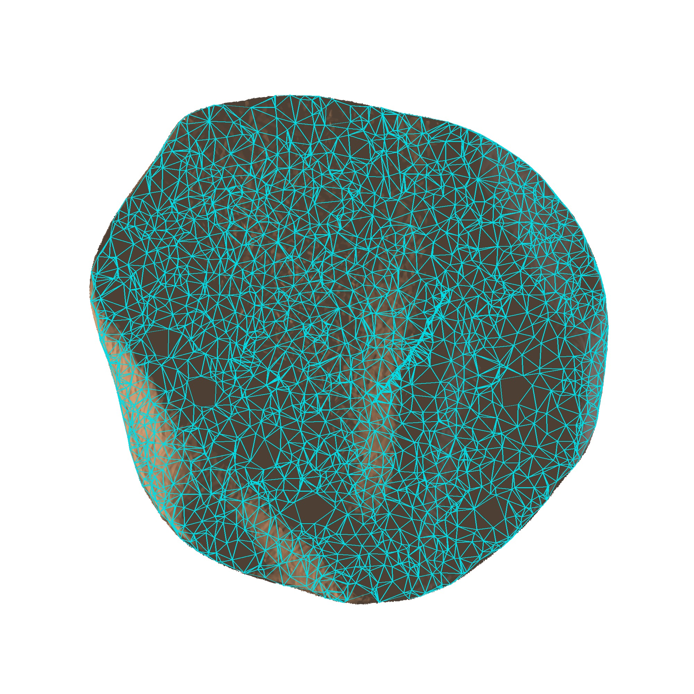
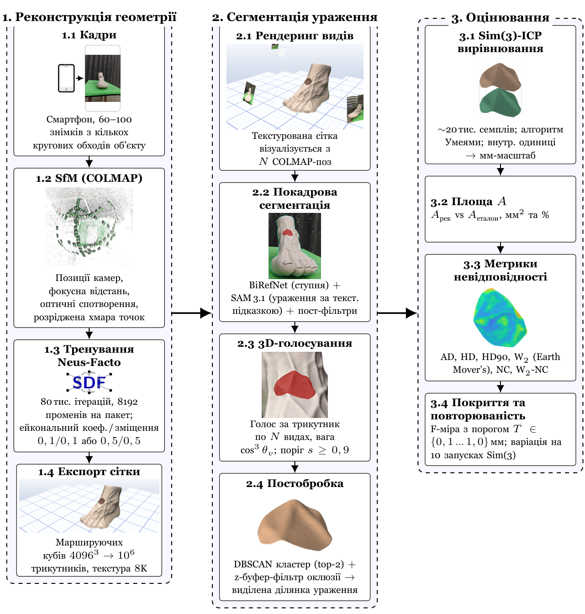
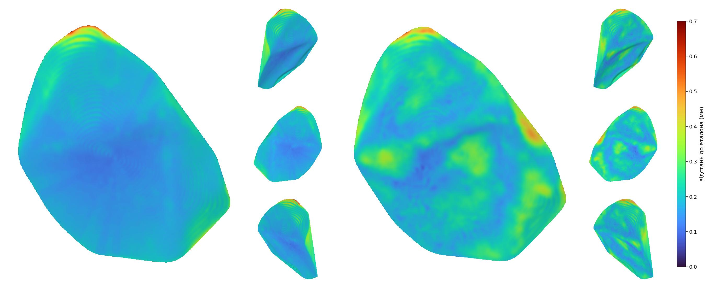
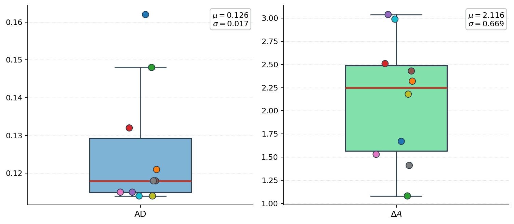
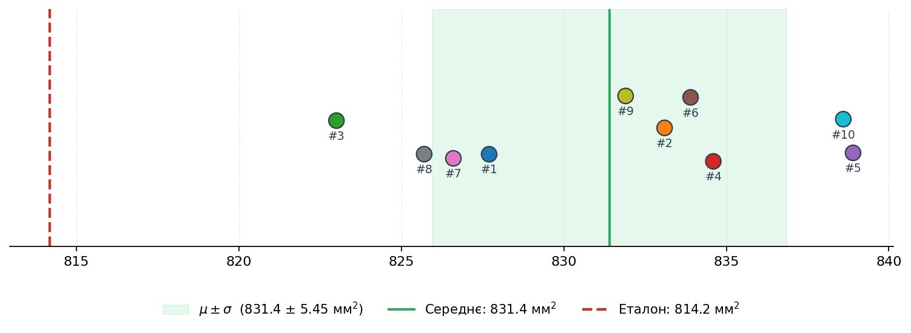

  
  
  

  
  
  
  
  
  
  
  

<h2 align="center"><a href="article.pdf">PDF</a></h2>

**Моделі:**

  <a href="runs/neus-facto/test4-sharpest-neus-facto-100k-d1-near0p01-far5p0-nomask-bias0p5-1Mf-8ktex-3090polandR2/neus-facto/run/mesh.glb">Test1</a> |
  <a href="runs/neus-facto/test6-sharpest-neus-facto-100k-d1-near0p01-far5p0-nomask-bias0p5-1Mf-8ktex-3090polandNEW/neus-facto/run/mesh.glb">Test2</a> |
  <a href="runs/neus-facto/test8-sharpest-fixed-neus-facto-80k-bias0p5-eik0p5-MAX-3090quebec/neus-facto/run/mesh.glb">Test3</a> |
  <a href="runs/neus-facto/test10-sharpest-neus-facto-80k-bias0p1-eik0p1-MAX-3090quebec/neus-facto/run/mesh.glb">Test4</a> |
  <a href="runs/neus-facto/test11-fixed-neus-facto-80k-bias0p1-eik0p1-MAX-3090polandR2/neus-facto/run/mesh.glb">Test5</a> |
  <a href="runs/neus-facto/test12-fixed-neus-facto-80k-bias0p5-eik0p5-MAX-3090quebec2/neus-facto/run/mesh.glb">Test6</a> |
  <a href="runs/neus-facto/test13-fixed-neus-facto-80k-bias0p5-eik0p5-MAX-3090quebec2/neus-facto/run/mesh.glb">Test7</a> |
  <a href="runs/neus-facto/test14-fixed-neus-facto-80k-bias0p5-eik0p5-MAX-3090norway/neus-facto/run/mesh.glb">Test8</a> |
  <a href="runs/neus-facto/test15-fixed-neus-facto-80k-bias0p1-eik0p5-MAX-3090alberta/neus-facto/run/mesh.glb">Test9</a> |
  <a href="runs/neus-facto/test16-fixed-neus-facto-80k-bias0p1-eik0p1-MAX-3090alberta/neus-facto/run/mesh.glb">Test10</a>

**Меші ураження:**

  <a href="runs/test4/eval/lesion_final.ply">Test1</a> |
  <a href="runs/test6/eval/lesion_final.ply">Test2</a> |
  <a href="runs/test8/eval/lesion_final.ply">Test3</a> |
  <a href="runs/test10/eval/lesion_final.ply">Test4</a> |
  <a href="runs/test11/eval/lesion_final.ply">Test5</a> |
  <a href="runs/test12/eval/lesion_final.ply">Test6</a> |
  <a href="runs/test13/eval/lesion_final.ply">Test7</a> |
  <a href="runs/test14/eval/lesion_final.ply">Test8</a> |
  <a href="runs/test15/eval/lesion_final.ply">Test9</a> |
  <a href="runs/test16/eval/lesion_final.ply">Test10</a>

**Фотографії:**

  <a href="runs/neus-facto/test4-sharpest-neus-facto-100k-d1-near0p01-far5p0-nomask-bias0p5-1Mf-8ktex-3090polandR2/_dataset/images_orig">Test1</a> |
  <a href="runs/neus-facto/test6-sharpest-neus-facto-100k-d1-near0p01-far5p0-nomask-bias0p5-1Mf-8ktex-3090polandNEW/_dataset/images_orig">Test2</a> |
  <a href="runs/neus-facto/test8-sharpest-fixed-neus-facto-80k-bias0p5-eik0p5-MAX-3090quebec/_dataset/images_orig">Test3</a> |
  <a href="runs/neus-facto/test10-sharpest-neus-facto-80k-bias0p1-eik0p1-MAX-3090quebec/_dataset/images_orig">Test4</a> |
  <a href="runs/neus-facto/test11-fixed-neus-facto-80k-bias0p1-eik0p1-MAX-3090polandR2/_dataset/images_orig">Test5</a> |
  <a href="runs/neus-facto/test12-fixed-neus-facto-80k-bias0p5-eik0p5-MAX-3090quebec2/_dataset/images_orig">Test6</a> |
  <a href="runs/neus-facto/test13-fixed-neus-facto-80k-bias0p5-eik0p5-MAX-3090quebec2/_dataset/images_orig">Test7</a> |
  <a href="runs/neus-facto/test14-fixed-neus-facto-80k-bias0p5-eik0p5-MAX-3090norway/_dataset/images_orig">Test8</a> |
  <a href="runs/neus-facto/test15-fixed-neus-facto-80k-bias0p1-eik0p5-MAX-3090alberta/_dataset/images_orig">Test9</a> |
  <a href="runs/neus-facto/test16-fixed-neus-facto-80k-bias0p1-eik0p1-MAX-3090alberta/_dataset/images_orig">Test10</a>

  

*Найкраща деталізація, яку вдалось отримати.*

## Про роботу

Робота оцінює точність та повторюваність вимірювання площі шкірного ураження за допомогою методу нейронної реконструкції неявних поверхонь **Neus-Facto** (SDF-сімейство) на 3D-друкованому анатомічному фантомі ступні зі вбудованою ділянкою ураження. Еталонна геометрія задана *проєктуванням* (CAD-модель), а не вимірюванням сторонньою системою — це усуває з оцінювання похибку самого еталона. Зйомка виконується звичайним смартфоном (OnePlus 13) за документованим протоколом; конвеєр повністю автоматизований: **COLMAP** SfM → тренування Neus-Facto в **SDFStudio** (через Docker-обгортку **mini-mesh**) → експорт сітки → багатовидова сегментація ділянки (**BiRefNet** + **SAM 3.1** з текстовою підказкою) → Sim(3)-ICP вирівнювання та оцінювання в **Open3D**. На 10 незалежних фізичних сесіях зйомки одного фантома досягнута повторюваність вимірюваної площі CV = 0,66 % при субміліметровій геометричній точності реконструкції (AD = 0,114–0,162 мм).

### Схема конвеєру

  

*Три блоки: (1) реконструкція геометрії — SfM + Neus-Facto + експорт сітки; (2) сегментація — багатовидове об'єднання 2D-масок на самій 3D-сітці; (3) оцінювання — Sim(3)-ICP, площа, метрики невідповідності, повторюваність.*

### Покадрова сегментація

  

*Послідовність сегментації одного кадру: блакитний контур — **BiRefNet** (силует ступні, відсікається фон); червона маска — **SAM 3.1** (ділянка ураження за текстовою підказкою). SAM виконується у **два проходи** для уточнення меж: спочатку на BiRefNet-кропі ступні, потім по результату першого SAM беремо bbox + невеликий padding і робимо другий прохід на тіснішому кропі. Додатково застосовується низка фільтрів-«страховок» (LAB-фільтр на яскравість маски, обмеження максимальної площі, largest connected component), які відсікають типові помилки SAM.*

## Результати

Повторюваність площі за 10 незалежними сесіями зйомки одного фантома: **CV = 0,66 %**. Точність геометрії: **AD = 0,114–0,162 мм**. Систематичний зсув площі: **+1,08…+3,04 %** від CAD-еталона.

### Метрики невідповідності (10 запусків)

| | № | AD (мм) | HD (мм) | HD₉₀ (мм) | NC | F1@0,3 | F1@0,5 | A (мм²) | ΔA |
|---|---|---|---|---|---|---|---|---|---|
| $\color{#1f77b4}\blacksquare$ | 1  | 0,162 | 0,659 | 0,258 | 0,9900 | 96,3 % | 99,9 % | 827,7 | +1,67 % |
| $\color{#ff7f0e}\blacksquare$ | 2  | 0,121 | 0,751 | 0,194 | 0,9854 | 99,3 % | 99,9 % | 833,1 | +2,32 % |
| $\color{#2ca02c}\blacksquare$ | 3  | 0,148 | 0,683 | 0,246 | 0,9919 | 95,9 % | 99,9 % | 823,0 | +1,08 % |
| $\color{#d62728}\blacksquare$ | 4  | 0,132 | 0,679 | 0,211 | 0,9866 | 99,2 % | 99,9 % | 834,6 | +2,51 % |
| $\color{#9467bd}\blacksquare$ | 5  | 0,115 | 0,833 | 0,188 | 0,9801 | 99,3 % | 99,8 % | 838,9 | +3,04 % |
| $\color{#8c564b}\blacksquare$ | 6  | 0,118 | 0,870 | 0,194 | 0,9907 | 99,1 % | 99,8 % | 833,9 | +2,43 % |
| $\color{#e377c2}\blacksquare$ | 7  | 0,115 | 0,764 | 0,189 | 0,9921 | 99,2 % | 99,8 % | 826,6 | +1,53 % |
| $\color{#7f7f7f}\blacksquare$ | 8  | 0,118 | 0,731 | 0,191 | 0,9906 | 99,4 % | 99,9 % | 825,7 | +1,41 % |
| $\color{#bcbd22}\blacksquare$ | 9  | 0,114 | 0,811 | 0,185 | 0,9879 | 99,3 % | 99,8 % | 831,9 | +2,18 % |
| $\color{#17becf}\blacksquare$ | 10 | 0,114 | 0,881 | 0,188 | 0,9837 | 99,1 % | 99,7 % | 838,6 | +2,99 % |

*A — виміряна площа після Sim(3)-ICP; ΔA — зсув щодо CAD-еталона 814,18 мм².*

### Повторюваність метрик (10 запусків)

| Метрика | μ | σ | min–max | CV |
|---|---|---|---|---|
| AD (мм) | 0,126 | 0,017 | 0,114–0,162 | 13,3 % |
| HD (мм) | 0,766 | 0,080 | 0,659–0,881 | 10,5 % |
| HD₉₀ (мм) | 0,204 | 0,026 | 0,185–0,258 | 12,9 % |
| A (мм²) | 831,40 | 5,46 | 823,0–838,9 | **0,66 %** |
| ΔA | +2,12 % | 0,67 % | +1,08…+3,04 % | — |
| F1@0,3 мм | 98,60 % | 1,32 % | 95,88–99,36 % | 1,3 % |
| F1@0,5 мм | 99,85 % | 0,07 % | 99,73–99,94 % | 0,07 % |
| NC | 0,9879 | 0,0039 | 0,980–0,992 | 0,4 % |

### Порівняння з SALVE (Neus-Facto, iPhone)

| Постановка | AD (мм) | HD (мм) | HD₉₀ (мм) |
|---|---|---|---|
| **Ця робота** | 0,114–0,162 | 0,659–0,881 | 0,185–0,258 |
| SALVE / PIS3 | 0,215 | 2,689 | 0,499 |
| SALVE / PIS4 | 0,355 | 9,956 | 0,730 |
| SALVE / SD | 0,216 | 1,990 | 0,499 |

### Візуальне порівняння 10 запусків

  

*Перші дві клітинки — еталонне фото та маска сегментації; решта — 10 реконструкцій у спільному ракурсі.*

### Карти відстаней до CAD-еталона (найкращий та найгірший за AD запуски)

  

*Синє — мала відстань до еталона (~0 мм), червоне — більше. Навіть для гіршого запуску переважна частина поверхні відстає менш ніж на 0,3 мм.*

### Розкид метрик і площі

  

*Box plot основних метрик невідповідності за 10 запусками.*

  

*Розподіл виміряної площі; червона лінія — CAD-еталон 814,18 мм².*
