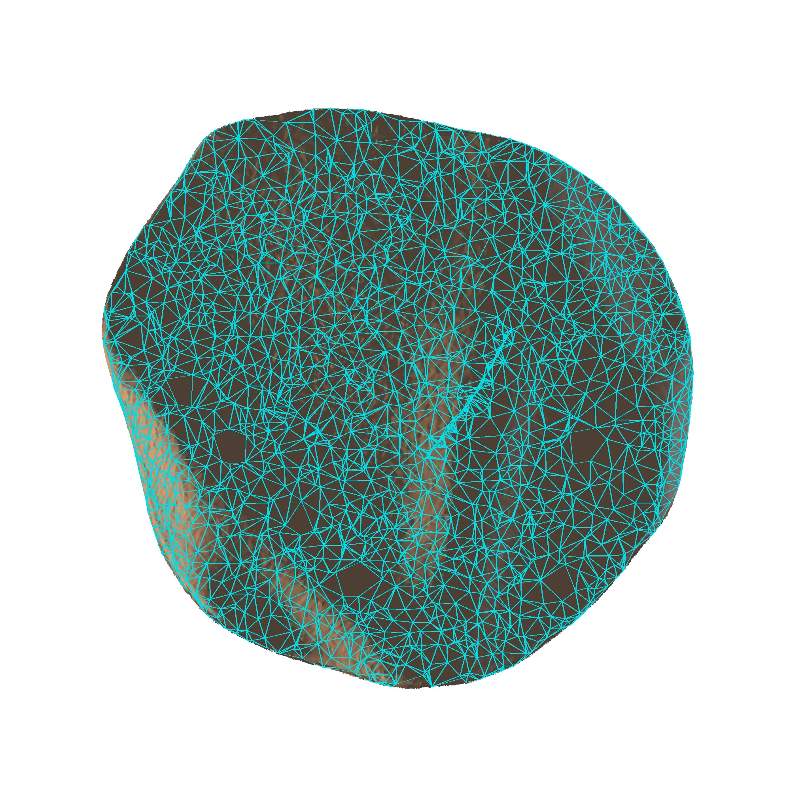
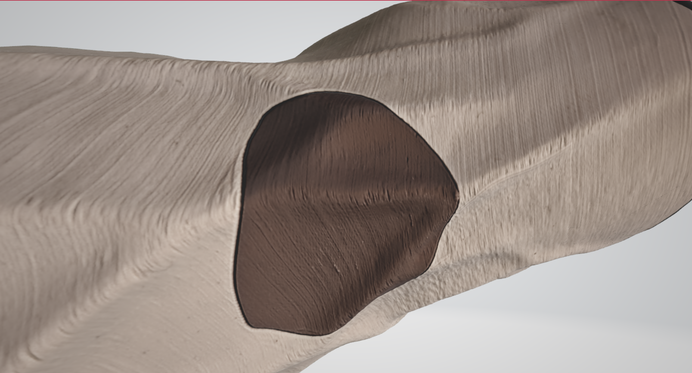
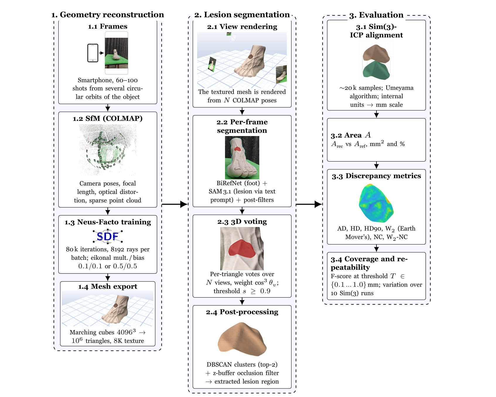
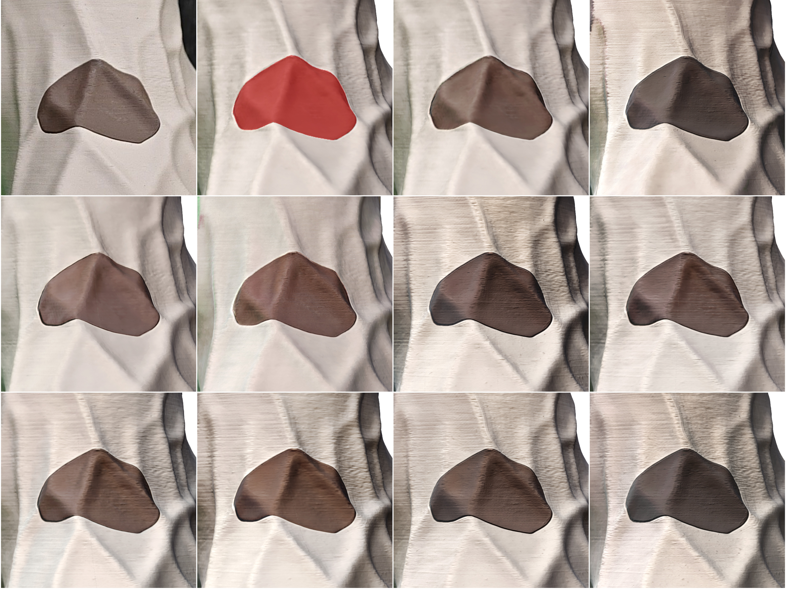
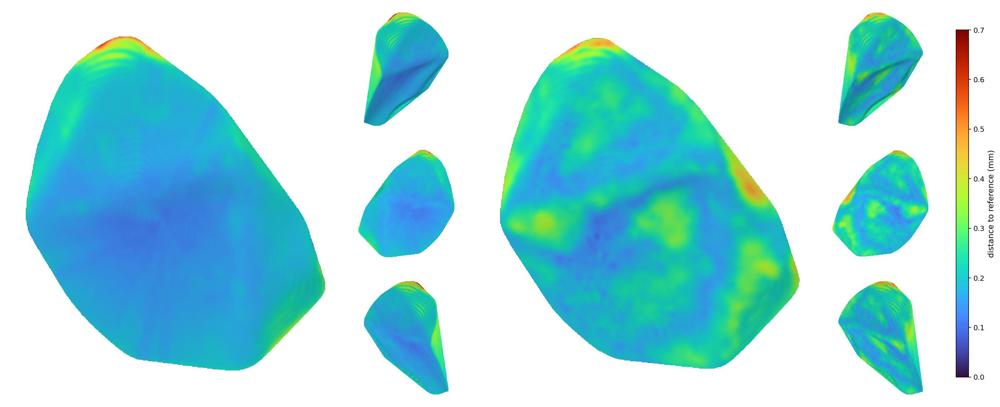
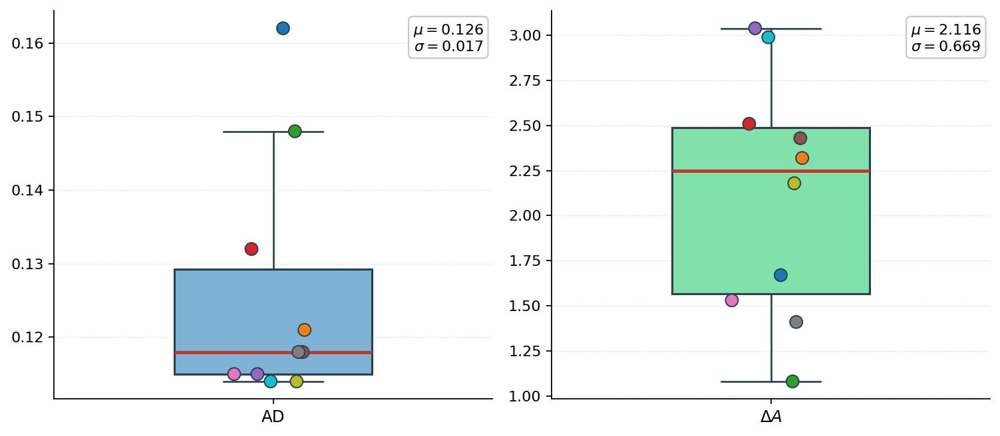
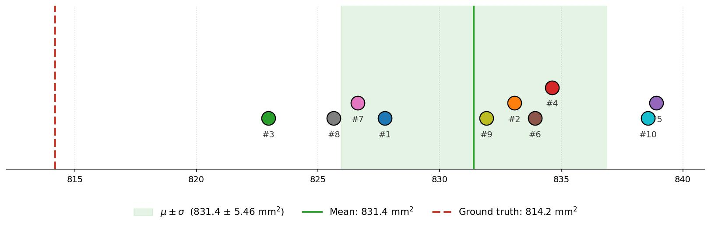

  
  
  

  
  
  
  
  
  
  
  

<h2 align="center"><a href="MDPI%20article_en.docx">Article (DOCX)</a></h2>

**Models:**

  <a href="runs/neus-facto/test4-sharpest-neus-facto-100k-d1-near0p01-far5p0-nomask-bias0p5-1Mf-8ktex-3090polandR2/neus-facto/run/mesh.glb">Test1</a> |
  <a href="runs/neus-facto/test6-sharpest-neus-facto-100k-d1-near0p01-far5p0-nomask-bias0p5-1Mf-8ktex-3090polandNEW/neus-facto/run/mesh.glb">Test2</a> |
  <a href="runs/neus-facto/test8-sharpest-fixed-neus-facto-80k-bias0p5-eik0p5-MAX-3090quebec/neus-facto/run/mesh.glb">Test3</a> |
  <a href="runs/neus-facto/test10-sharpest-neus-facto-80k-bias0p1-eik0p1-MAX-3090quebec/neus-facto/run/mesh.glb">Test4</a> |
  <a href="runs/neus-facto/test11-fixed-neus-facto-80k-bias0p1-eik0p1-MAX-3090polandR2/neus-facto/run/mesh.glb">Test5</a> |
  <a href="runs/neus-facto/test12-fixed-neus-facto-80k-bias0p5-eik0p5-MAX-3090quebec2/neus-facto/run/mesh.glb">Test6</a> |
  <a href="runs/neus-facto/test13-fixed-neus-facto-80k-bias0p5-eik0p5-MAX-3090quebec2/neus-facto/run/mesh.glb">Test7</a> |
  <a href="runs/neus-facto/test14-fixed-neus-facto-80k-bias0p5-eik0p5-MAX-3090norway/neus-facto/run/mesh.glb">Test8</a> |
  <a href="runs/neus-facto/test15-fixed-neus-facto-80k-bias0p1-eik0p5-MAX-3090alberta/neus-facto/run/mesh.glb">Test9</a> |
  <a href="runs/neus-facto/test16-fixed-neus-facto-80k-bias0p1-eik0p1-MAX-3090alberta/neus-facto/run/mesh.glb">Test10</a>

**Lesion meshes:**

  <a href="runs/test4/eval/lesion_final.ply">Test1</a> |
  <a href="runs/test6/eval/lesion_final.ply">Test2</a> |
  <a href="runs/test8/eval/lesion_final.ply">Test3</a> |
  <a href="runs/test10/eval/lesion_final.ply">Test4</a> |
  <a href="runs/test11/eval/lesion_final.ply">Test5</a> |
  <a href="runs/test12/eval/lesion_final.ply">Test6</a> |
  <a href="runs/test13/eval/lesion_final.ply">Test7</a> |
  <a href="runs/test14/eval/lesion_final.ply">Test8</a> |
  <a href="runs/test15/eval/lesion_final.ply">Test9</a> |
  <a href="runs/test16/eval/lesion_final.ply">Test10</a>

**Photographs:**

  <a href="runs/neus-facto/test4-sharpest-neus-facto-100k-d1-near0p01-far5p0-nomask-bias0p5-1Mf-8ktex-3090polandR2/_dataset/images_orig">Test1</a> |
  <a href="runs/neus-facto/test6-sharpest-neus-facto-100k-d1-near0p01-far5p0-nomask-bias0p5-1Mf-8ktex-3090polandNEW/_dataset/images_orig">Test2</a> |
  <a href="runs/neus-facto/test8-sharpest-fixed-neus-facto-80k-bias0p5-eik0p5-MAX-3090quebec/_dataset/images_orig">Test3</a> |
  <a href="runs/neus-facto/test10-sharpest-neus-facto-80k-bias0p1-eik0p1-MAX-3090quebec/_dataset/images_orig">Test4</a> |
  <a href="runs/neus-facto/test11-fixed-neus-facto-80k-bias0p1-eik0p1-MAX-3090polandR2/_dataset/images_orig">Test5</a> |
  <a href="runs/neus-facto/test12-fixed-neus-facto-80k-bias0p5-eik0p5-MAX-3090quebec2/_dataset/images_orig">Test6</a> |
  <a href="runs/neus-facto/test13-fixed-neus-facto-80k-bias0p5-eik0p5-MAX-3090quebec2/_dataset/images_orig">Test7</a> |
  <a href="runs/neus-facto/test14-fixed-neus-facto-80k-bias0p5-eik0p5-MAX-3090norway/_dataset/images_orig">Test8</a> |
  <a href="runs/neus-facto/test15-fixed-neus-facto-80k-bias0p1-eik0p5-MAX-3090alberta/_dataset/images_orig">Test9</a> |
  <a href="runs/neus-facto/test16-fixed-neus-facto-80k-bias0p1-eik0p1-MAX-3090alberta/_dataset/images_orig">Test10</a>

  

*The best level of surface detail we were able to obtain.*

## About

This work evaluates the accuracy and repeatability of skin-lesion surface-area measurement with the **Neus-Facto** neural implicit surface reconstruction method (SDF family) on a 3D-printed anatomical foot phantom with an embedded lesion region. The reference geometry is defined *by design* (a CAD model) rather than measured by a third-party system, which removes the reference's own error budget from the evaluation. Capture is performed with an ordinary smartphone (OnePlus 13) following a documented protocol; the pipeline is fully automated: **COLMAP** SfM → Neus-Facto training in **SDFStudio** (via the **mini-mesh** Docker wrapper) → mesh export → multi-view lesion segmentation (**BiRefNet** + **SAM 3.1** with a text prompt) → Sim(3)-ICP alignment and evaluation in **Open3D**. Across 10 independent physical capture sessions of the same phantom, the repeatability of the measured area is CV = 0.66% with sub-millimeter geometric accuracy of the reconstruction (AD = 0.114–0.162 mm).

### Pipeline overview

  

*Three blocks: (1) geometry reconstruction — SfM + Neus-Facto + mesh export; (2) segmentation — multi-view fusion of 2D masks directly on the 3D mesh; (3) evaluation — Sim(3)-ICP, area, discrepancy metrics, repeatability.*

### Per-frame segmentation

  

*Segmentation sequence for a single frame: cyan contour — **BiRefNet** (foot silhouette, background removal); red mask — **SAM 3.1** (lesion region via a text prompt). SAM runs in **two passes** to refine the boundary: first on the BiRefNet foot crop, then a second pass on a tighter crop given by the bbox of the first SAM result plus a small padding. A set of additional "safety" filters (a LAB brightness filter on the mask, a maximum-area cap, largest-connected-component selection) rejects typical SAM failure modes.*

## Results

Repeatability of the measured area across 10 independent capture sessions of the same phantom: **CV = 0.66%**. Geometric accuracy: **AD = 0.114–0.162 mm**. Systematic area bias: **+1.08…+3.04%** relative to the CAD reference.

### Discrepancy metrics (10 runs)

| | № | AD (mm) | HD (mm) | HD₉₀ (mm) | NC | F1@0.3 | F1@0.5 | A (mm²) | ΔA |
|---|---|---|---|---|---|---|---|---|---|
| $\color{#1f77b4}\blacksquare$ | 1  | 0.162 | 0.659 | 0.258 | 0.9900 | 96.3% | 99.9% | 827.7 | +1.67% |
| $\color{#ff7f0e}\blacksquare$ | 2  | 0.121 | 0.751 | 0.194 | 0.9854 | 99.3% | 99.9% | 833.1 | +2.32% |
| $\color{#2ca02c}\blacksquare$ | 3  | 0.148 | 0.683 | 0.246 | 0.9919 | 95.9% | 99.9% | 823.0 | +1.08% |
| $\color{#d62728}\blacksquare$ | 4  | 0.132 | 0.679 | 0.211 | 0.9866 | 99.2% | 99.9% | 834.6 | +2.51% |
| $\color{#9467bd}\blacksquare$ | 5  | 0.115 | 0.833 | 0.188 | 0.9801 | 99.3% | 99.8% | 838.9 | +3.04% |
| $\color{#8c564b}\blacksquare$ | 6  | 0.118 | 0.870 | 0.194 | 0.9907 | 99.1% | 99.8% | 833.9 | +2.43% |
| $\color{#e377c2}\blacksquare$ | 7  | 0.115 | 0.764 | 0.189 | 0.9921 | 99.2% | 99.8% | 826.6 | +1.53% |
| $\color{#7f7f7f}\blacksquare$ | 8  | 0.118 | 0.731 | 0.191 | 0.9906 | 99.4% | 99.9% | 825.7 | +1.41% |
| $\color{#bcbd22}\blacksquare$ | 9  | 0.114 | 0.811 | 0.185 | 0.9879 | 99.3% | 99.8% | 831.9 | +2.18% |
| $\color{#17becf}\blacksquare$ | 10 | 0.114 | 0.881 | 0.188 | 0.9837 | 99.1% | 99.7% | 838.6 | +2.99% |

*A — measured area after Sim(3)-ICP; ΔA — deviation from the CAD reference 814.18 mm².*

### Repeatability of the metrics (10 runs)

| Metric | μ | σ | min–max | CV |
|---|---|---|---|---|
| AD (mm) | 0.126 | 0.017 | 0.114–0.162 | 13.3% |
| HD (mm) | 0.766 | 0.080 | 0.659–0.881 | 10.5% |
| HD₉₀ (mm) | 0.204 | 0.026 | 0.185–0.258 | 12.9% |
| A (mm²) | 831.40 | 5.46 | 823.0–838.9 | **0.66%** |
| ΔA | +2.12% | 0.67% | +1.08…+3.04% | — |
| F1@0.3 mm | 98.60% | 1.32% | 95.88–99.36% | 1.3% |
| F1@0.5 mm | 99.85% | 0.07% | 99.73–99.94% | 0.07% |
| NC | 0.9879 | 0.0039 | 0.980–0.992 | 0.4% |

### Comparison with SALVE (Neus-Facto, iPhone)

| Setting | AD (mm) | HD (mm) | HD₉₀ (mm) |
|---|---|---|---|
| **This work** | 0.114–0.162 | 0.659–0.881 | 0.185–0.258 |
| SALVE / PIS3 | 0.215 | 2.689 | 0.499 |
| SALVE / PIS4 | 0.355 | 9.956 | 0.730 |
| SALVE / SD | 0.216 | 1.990 | 0.499 |

### Visual comparison of the 10 runs

  

*The first two cells are the reference photo and the segmentation mask; the remaining cells are the 10 reconstructions in a common viewpoint.*

### Distance maps to the CAD reference (best and worst runs by AD)

  

*Blue — small distance to the reference (~0 mm), red — larger. Even for the worst run, most of the surface deviates by less than 0.3 mm.*

### Metric and area spread

  

*Box plots of the main discrepancy metrics over the 10 runs.*

  

*Distribution of the measured area; the red line is the CAD reference of 814.18 mm².*
