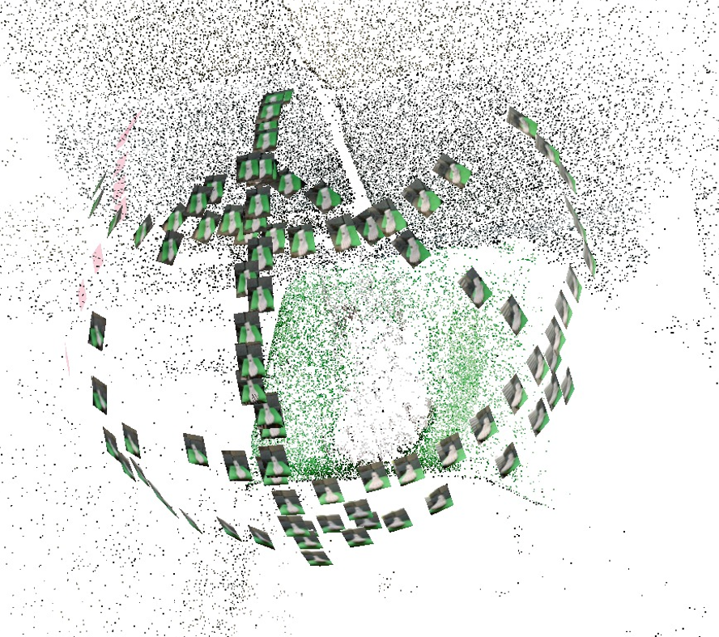
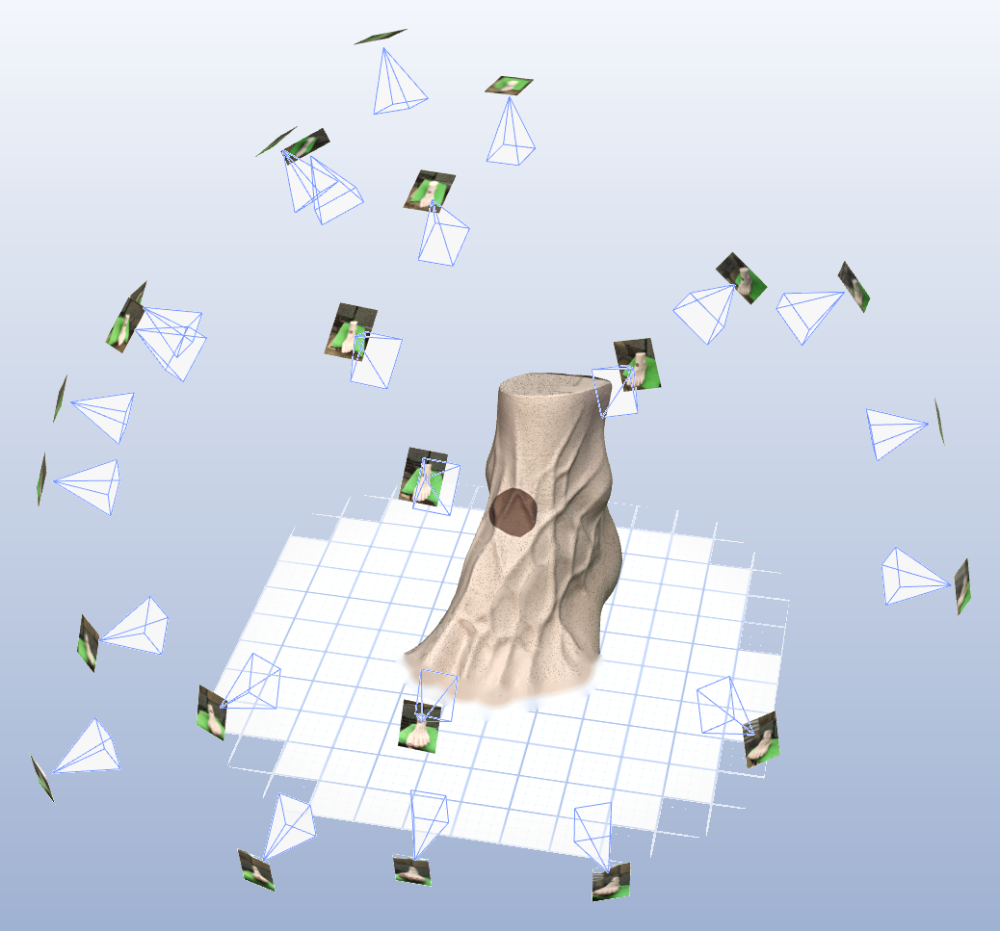
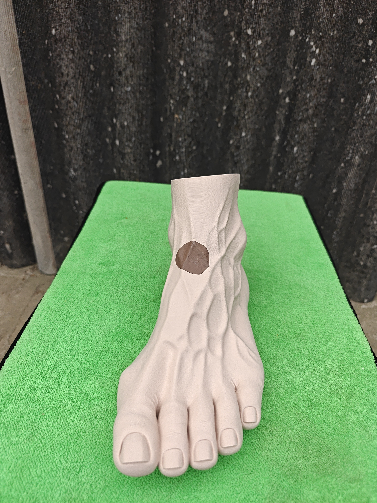

# Вступ

Шкірні ураження та хронічні рани становлять значне клінічне й економічне навантаження на системи охорони здоров'я в усьому світі. Точне та відтворюване вимірювання площі ураження є ключовим елементом моніторингу динаміки загоєння, оцінювання ефективності лікування та клінічного документування. У повсякденній практиці такі вимірювання досі переважно виконуються вручну --- планіметрією на прозорій плівці або звичайною лінійкою, --- що є інвазивним для пацієнта, повільним, неточним та сильно залежним від кваліфікації оператора.

Цифрові двовимірні підходи на основі смартфон-зйомки частково розв'язують проблему стандартизації, проте лишають принципові методологічні обмеження. Площа, обчислена як кількість пікселів у межах сегментованої області, залежить від ракурсу камери та її відстані до об'єкта і фактично є проекцією тривимірної поверхні на площину сенсора. Для уражень на викривлених анатомічних поверхнях --- ступні, гомілці, п'ятці --- обчислена таким чином площа відрізняється від справжньої і змінюється для одного й того самого ураження від знімка до знімка [@chierchia2025salve; @wang2025dlcolmap; @medela2026monocular]. Ані глибину рани, ані периметр на тривимірній поверхні таким способом достовірно отримати неможливо.

Попри ці обмеження, саме смартфон-зйомка залишається найдоступнішою у розгортанні модальністю отримання вхідних даних: сучасний смартфон є інструментом, який вже наявний у більшості закладів охорони здоров'я, у тому числі тих, що працюють в умовах обмежених ресурсів на закупівлю обладнання. Спеціалізовані 3D-сканери, стереосистеми та системи структурованого світла, хоч і точніші, потребують виділеного бюджету, навчання персоналу та фізичної інтеграції в робочий процес лікаря.

Перехід до тривимірної реконструкції геометрії ураження знімає ці обмеження безпосередньо: маючи цифрову модель поверхні, площу можна обчислити інваріантно щодо ракурсу як суму площ трикутників полігональної сітки (див. @eq-area-sum). У літературі представлено декілька конкуруючих напрямків --- класична фотограмметрія, нейронна реконструкція неявних поверхонь, Gaussian Splatting [@kerbl20233dgs] та підходи на основі одного зображення з оцінкою глибини за фундаментальними моделями, --- детальний огляд яких наведено далі. Якість підсумкової реконструкції залежить як від обраного методу, так і, що часто недооцінюється, від якості вхідних зображень: фокусу, експозиції, освітлення та повноти кутового покриття.

Серед нейронних підходів родина методів зі знаковою функцією відстані (SDF) --- NeuS [@wang2021neus], Neuralangelo [@li2023neuralangelo] та особливо швидкий варіант Neus-Facto з фреймворку SDFStudio [@yu2022sdfstudio] --- демонструє найвищу геометричну точність та повторюваність у нещодавньому емпіричному порівнянні SALVE [@chierchia2025salve]. Втім, оцінювання в SALVE проведено на силіконових макетах TraumaSIM, ізольованих від анатомічного контексту: вони не обмежені геометрією тієї ділянки тіла, на якій реальне ураження зазвичай знаходиться, --- а ця геометрія в клінічних умовах суттєво обмежує доступні ракурси зйомки і, відповідно, має критичний вплив на якість 3D-реконструкції. До того ж самі макети великі за розміром, з насиченим забарвленням і посиленим рельєфом, що полегшує задачу зіставлення ознак для алгоритмів SfM/MVS і не відтворює реалістичних умов клінічної зйомки. Еталоном слугує сканер структурованого світла --- сам по собі емпіричний прилад зі своєю похибкою вимірювання, через що поведінку методу реконструкції важко відокремити від похибки самого еталону.

# Огляд літератури

Літературу, дотичну до нашої теми, можна умовно розділити на два типи робіт: ті, що пропонують *порівняльні дослідження* методів 3D-реконструкції (англ. *benchmarks*), і ті, що описують *готові конвеєри* для вимірювання та аналізу шкірних уражень. Прямих медичних робіт, у яких оцінювалось би Neus-Facto саме на *фізичному анатомічному об'єкті*, у літературі знайти майже не вдається: крім SALVE [@chierchia2025salve], найближче знаходиться Syn3DWound [@lebrat2024syn3dwound], але цей датасет цілком синтетичний.

## Порівняльні дослідження методів 3D-реконструкції

Порівняльні дослідження зосереджуються на емпіричному порівнянні методів реконструкції за метриками точності геометрії, повторюваності та фотометричної якості рендерингу. У медичному контексті ключовою такою роботою є SALVE [@chierchia2025salve], яка порівнює дев'ять методів (від COLMAP та Meshroom до SuGaR [@guedon2024sugar], 2DGS [@huang20242dgs], Neuralangelo, Neus-Facto та інших) на трьох силіконових фантомах TraumaSIM (типи PIS3, PIS4, SD), знятих iPhone 14 Pro Max і Logitech 4K Webcam, з еталонною геометрією від сканера структурованого світла Revopoint POP 2. За результатами SALVE, Neuralangelo, Neus-Facto та Meshroom послідовно лідирують за точністю, причому Neus-Facto додатково демонструє найкращу стійкість до зміни пристрою зйомки. За словами авторів, SDF-формулювання дозволяє таким методам регуляризувати шум вхідних даних, що забезпечує точні, повторювані та гладкі реконструкції [@chierchia2025salve]. Це й робить SALVE найважливішим прямим орієнтиром нашої роботи та мотивує вибір саме Neus-Facto як предмета вузько сфокусованого оцінювання.

Водночас SALVE залишає відкритими низку методологічних питань: похибка самого еталонного сканера того самого порядку, що й заявлена точність найкращих методів, --- тобто інтерпретація мм-результатів вимагає обережності; "повторюваність" вимірюється підвибірками кадрів з одного відео, а не окремими фізичними сесіями зйомки; виділення області рани здійснюється ручним полігоном, що замінює сегментацію та вносить суб'єктивність; розміри фантомів у статті не наведено.

Окремо ця ж група авторів випустила Syn3DWound [@lebrat2024syn3dwound] --- датасет повністю синтетичних 3D-ран, створених у комп'ютерній графіці. Syn3DWound корисний для тестування сегментаційних моделей, але для оцінювання методів 3D-реконструкції на реальних медичних об'єктах він непридатний за побудовою: усі вхідні зображення є рендерами, що ігнорує саме ту проблему, заради якої такі алгоритми застосовуються в клініці, --- реконструкцію реальних поверхонь зі смартфон-зйомки з усім властивим їй шумом, спотвореннями та обмеженнями ракурсу.

Серед немедичних порівняльних робіт, у яких фігурує Neus-Facto, варто згадати NeRFBK [@karami2023nerfbk] --- датасет групи Fondazione Bruno Kessler, який порівнює NeRF-методи (включно з Neus-Facto та Nerfacto) на indoor і outdoor сценах із еталоном від лазерного сканування, --- та MuSHRoom [@ren2024mushroom], орієнтований на сумісну reconstruction + novel-view synthesis у кімнатах, знятих смартфонами та Kinect, з еталоном від Faro-сканера. DN-Splatter [@turkulainen2024dnsplatter], хоча й позиціюється як новий метод (depth-+-normal priors для Gaussian Splatting), у експериментальній частині порівнюється з SDFStudio-методами; характерно, що автори застосовували для Neus-Facto налаштування за замовчуванням, які на практиці рідко дають оптимальний меш без ручного підбору гіперпараметрів під сцену. Жодна з цих немедичних порівняльних робіт не дає відповіді на питання, наскільки Neus-Facto придатний для шкірних уражень в анатомічному контексті, тому методологічна прогалина залишається відкритою.

## Готові конвеєри вимірювання шкірних уражень

Інший клас робіт пропонує повний конвеєр оцінювання шкірних уражень --- від зйомки до клінічно інтерпретовних метрик. Wound3DAssist [@chierchia2025wound3dassist] (та сама група, що SALVE) інтегрує Meshroom-фотограмметрію, SegFormer-сегментацію, ArUco-масштабування та модуль аналізу прилеглих до рани тканин в єдиний фреймворк для смартфон-відео. Тестування на цифрових моделях, силіконових фантомах та реальних пацієнтах показує близько 1 мм попіксельну похибку, але автори самі визнають, що точніша оцінка потребувала б еталонних сканів вищої роздільної здатності та контрольованих умов зйомки [@chierchia2025wound3dassist].

Та сама група в WoundNeRF [@chierchia2026woundnerf] замінює класичну 2D-сегментацію на 3D-сегментацію через NeRF/SDF-поле із семантичним декодером. Це суттєво покращує мульти-view-сумісність сегментаційних масок, проте сама оцінка обмежена ручним порівнянням з лікарськими розмітками, без незалежного метричного еталону. Wang та ін. [@wang2025dlcolmap] комбінують глибинну нейронну сегментацію (M-CSAFN) з класичною фотограмметрією COLMAP для аналізу обличчевих винних плям (port-wine stains); ця робота не задіює нейронну 3D-реконструкцію, а виміряна середня відносна похибка 4,59 % проти структурованого сканера є відносно високою для клінічних застосувань.

Спільним обмеженням конвеєр-робіт є те, що вони оцінюють кінцевий продукт --- комбінацію реконструкції, сегментації та масштабування --- як єдиний blackbox, через що складно відокремити внески кожної стадії в підсумкову похибку. Наша робота свідомо звужує фокус до *оцінювання вузької частини* --- 3D-реконструкції методом Neus-Facto --- з контрольованим вхідним сигналом (CAD-еталон, що задається не вимірюванням, а проєктуванням) і документованим протоколом смартфон-зйомки. Це дозволяє виміряти саме внесок алгоритму реконструкції, не змішуючи його з похибками еталона або інших стадій конвеєра.

# Мета та внесок роботи

Дана робота зосереджена на оцінюванні точності 3D-реконструкції шкірного ураження методом Neus-Facto --- представником сімейства SDF-методів нейронної реконструкції неявних поверхонь, який у наявних емпіричних порівняннях [@chierchia2025salve] зарекомендував себе серед найточніших за геометрією та найстійкіших за повторюваністю. Мета --- оцінити цей метод в умовах, максимально наближених до реальної клінічної зйомки, але з достатньо суворим еталоном, щоб виміряти саме внесок алгоритму реконструкції, а не накопичену похибку всього вимірювального конвеєра.

Запропонована постановка експерименту свідомо обирається як альтернатива трьом моделям оцінювання, поширеним у літературі:

- *Замість повністю синтетичних датасетів* (де всі вхідні зображення є комп'ютерним рендерингом змодельованих уражень) ми використовуємо реальну смартфон-зйомку фізичного об'єкту, з усіма властивими реальній зйомці шумами, спотвореннями та обмеженнями ракурсу.
- *Замість ізольованих лабораторних макетів* на кшталт TraumaSIM (збільшених, насичено пофарбованих, з посиленим власним рельєфом) ми використовуємо спеціально спроєктований 3D-друкований анатомічний фантом, у якому ділянка ураження повторює реальну геометрію тіла довкола неї, а не є зручно ізольованою поверхнею.
- *Замість тестування на реальних пацієнтах*, де достовірний еталон практично неможливо встановити без дороговартісного спеціалізованого обладнання, а повторне оцінювання в ідентичних умовах ускладнено зміною самого ураження, розтягненням шкіри, варіаціями положення та інших факторів зйомки, CAD-модель фантома є детерміністичним і відтворюваним еталоном, що дозволяє повторювати експеримент у контрольованих умовах.

Основними внесками роботи є:

1. Методика оцінювання точності 3D-реконструкції шкірних уражень з еталонною геометрією у формі цифрової CAD-моделі, реалізованої через 3D-друкований анатомічний фантом.
2. Документований протокол смартфон-зйомки споживчого рівня, придатний для нейронної 3D-реконструкції.
3. Емпірична оцінка точності, повторюваності та чутливості Neus-Facto до умов зйомки в режимі, наближеному до реальної клінічної.
4. Аналіз впливу якості зйомки та параметрів реконструкції на підсумкову похибку вимірювання площі.

# Теоретичні засади

## Чому площа тривимірної поверхні є точнішою за двовимірну проєкцію

Будь-яке зображення, отримане одним сенсором, є двовимірною проєкцією тривимірної сцени. Для елементарної ділянки поверхні з площею $dA$ і нормаллю $\mathbf{n}$ її проєкція на площину сенсора матиме площу

$$
dA_{\text{2D}} = dA \cdot \lvert\cos\theta\rvert,
$$ {#eq-cosine-projection}

де $\theta$ --- кут між нормаллю $\mathbf{n}$ і оптичною віссю камери (за наближення ортогональної проєкції). Оскільки $\lvert\cos\theta\rvert \le 1$, проєктована площа завжди не перевищує справжню; рівність досягається лише за умови, коли поверхня перпендикулярна до оптичної осі ($\theta = 0$). При нахилі ділянки відносно камери проєкція систематично занижує площу, причому похибка зростає як зі збільшенням $\theta$, так і з посиленням викривлення поверхні в межах одного знімка. При використанні реальних об'єктивів додатково накладається перспективне спотворення, через яке однаковий за площею елемент поверхні займає різну кількість пікселів залежно від відстані до камери.

Геометрична суть цього ефекту проілюстрована на рис. \ref{fig-projection-area}: ділянка $dA$ на викривленій поверхні має нормаль $\mathbf{n}$, що відхилена від оптичної осі камери на кут $\theta$, --- і на площині сенсора вона займає лише $dA\cos\theta$.

\begin{figure}[t]
\centering
\begin{tikzpicture}[scale=0.95, >=Latex]
  % Sensor plane
  \draw[thick] (-0.5, 4.5) -- (5.5, 4.5);
  \node[right, font=\small] at (5.5, 4.5) {сенсор};

  % Camera box and arrow (arrow starts below the box, with a small gap)
  \node[draw, rectangle, minimum width=14mm, minimum height=8mm, fill=gray!15, font=\small] (cam) at (2.5, 5.9) {камера};
  \draw[->, thick] (2.5, 5.4) -- (2.5, 4.95);

  % Body surface arc (semicircle)
  \draw[thick] (3, 0) arc[start angle=0, end angle=180, radius=3];
  \node[right, font=\small] at (3.1, 0.3) {поверхня тіла};
  \fill (0,0) circle (1.2pt);

  % Lesion arc (red)
  \draw[line width=2.5pt, red] (1.5, 2.598) arc[start angle=60, end angle=30, radius=3];
  \node[red, anchor=west, font=\small] at (2.85, 2.05) {$dA$};

  % Projection rays
  \draw[dashed, gray!70] (1.5, 2.598) -- (1.5, 4.5);
  \draw[dashed, gray!70] (2.598, 1.5) -- (2.598, 4.5);

  % Projected segment
  \draw[line width=2.5pt, red] (1.5, 4.5) -- (2.598, 4.5);
  \node[red, above, font=\small] at (2.05, 4.55) {$dA\cos\theta$};

  % Normal vector at midpoint (angle 45 deg on circle)
  \draw[->, blue, very thick] (2.121, 2.121) -- (3.0, 3.0);
  \node[blue] at (3.15, 3.15) {$\mathbf{n}$};

  % Vertical reference at lesion midpoint (optical-axis direction at that point)
  \draw[dashed, blue!50, thin] (2.121, 2.121) -- (2.121, 3.0);
  % Theta arc (between vertical reference and normal)
  \draw[blue, thick] (2.121, 2.55) arc[start angle=90, end angle=45, radius=0.43];
  \node[blue, font=\small] at (2.0, 2.85) {$\theta$};
\end{tikzpicture}
\caption{Принцип геометричної недооцінки 2D-проєкції на викривленій поверхні. Червона дуга --- справжня площа ділянки $dA$ на поверхні тіла; червоний відрізок на площині сенсора --- її 2D-проєкція $dA\cos\theta$. Зі збільшенням кута $\theta$ між нормаллю $\mathbf{n}$ і оптичною віссю проєкція скорочується, тобто 2D-вимірювання систематично занижує справжню площу.}
\label{fig-projection-area}
\end{figure}

Для тривимірно-викривлених анатомічних ділянок --- ступні, гомілки, п'ятки --- кут $\theta$ не є сталим у межах ураження: одні точки поверхні звернені до камери, інші виходять "за горизонт" поверхні. Тому однозначно скоригувати 2D-площу постфактум, маючи лише одне зображення, неможливо без додаткової інформації про тривимірну геометрію [@chierchia2025salve; @chierchia2025wound3dassist]. Зокрема, той самий шматок шкіри, знятий під різними ракурсами, дає різні значення площі, що унеможливлює коректне порівняння розмірів ураження в часі.

Емпіричні дослідження підтверджують значущість цього ефекту для шкірних уражень: у прямому порівнянні 2D- та 3D-алгоритмів на фантомах Мірзаалян та ін. [@mirzaalian2019surface] зафіксували відносну похибку 2D-методу 9,89\,$\pm$\,9,31\,\% проти менш ніж 5\,\% для 3D-реконструкції зі смартфон-відео. Чанг та ін. [@chang2025burn3d2d] показали, що співвідношення 3D/2D-вимірювань на різних ділянках тіла критично залежить від кривини: ${\sim}1,005$ на спині (плоска), $1,641$ на голові й шиї, та $1,908$ на тильному боці ступні --- тобто на ступні 2D-метод фіксує лише близько половини справжньої площі ураження.

Тривимірна реконструкція поверхні усуває цю похибку конструктивно: маючи відновлену геометрію, площу області ураження можна обчислити безпосередньо на самій поверхні, а не на її проєкції. При дискретному представленні полігональною сіткою це зводиться до суми площ окремих трикутників сегментованої підмножини (див. @eq-area-sum), і отримане значення інваріантне до позиції камери, з якої виконувалася зйомка для побудови сітки. Відмінність від 2D-вимірювань стає особливо суттєвою на сильно викривлених анатомічних ділянках --- саме там, де клінічна потреба у точному моніторингу ран і шкірних уражень є найбільш ускладненою.

::: {#fig-pipeline-input layout="[[1, -0.04, 1]]" layout-valign="top" fig-env="figure*" fig-pos="!t"}

{#fig-pipeline-colmap}

{#fig-pipeline-neus}

Вхід та вихід нейронної реконструкції. Ліворуч --- кадри та розріджена хмара точок у спільній системі координат після SfM; праворуч --- текстурований меш як остаточний вихід Neus-Facto.
:::

## Вимірювання площі поверхні на основі полігональної сітки

Якщо область ураження представлено набором трикутників полігональної сітки, її площу поверхні обчислюємо як суму площ окремих трикутників сегментованої підмножини $S$:

$$
A = \sum_{i \in S} A_i,
$$ {#eq-area-sum}

де площа окремого трикутника з вершинами $\mathbf{v}_1, \mathbf{v}_2, \mathbf{v}_3 \in \mathbb{R}^3$ визначається через половину модуля векторного добутку двох його сторін:

$$
A_i = \tfrac{1}{2} \lvert (\mathbf{v}_2 - \mathbf{v}_1) \times (\mathbf{v}_3 - \mathbf{v}_1) \rvert.
$$ {#eq-triangle-area}

Точність обчисленого значення $A$ залежить від двох незалежних джерел похибки: (i)геометричної точності самої реконструкції, тобто наскільки сітка відповідає справжній поверхні; (ii)точності виділення підмножини $S$, тобто сегментації трикутників, що належать саме до області ураження. У цій роботі ми зосереджуємось переважно на оцінюванні першого джерела похибки.

## Neus-Facto та нейронна реконструкція неявних поверхонь

Принципова відмінність нейронних методів від класичної фотограмметрії полягає в тому, що сцена представлена не дискретним набором точок чи трикутників, а *неперервною неявною функцією*, параметризованою нейронною мережею. Підхід Neural Radiance Fields (NeRF) [@mildenhall2020nerf] вперше показав, що багатовидову послідовність зображень можна представити через функцію $(\mathbf{x}, \mathbf{d}) \mapsto (c, \sigma)$, що повертає колір $c$ і об'ємну густину $\sigma$ у тривимірній точці $\mathbf{x}$ для напрямку погляду $\mathbf{d}$. Зображення з довільного ракурсу отримується через інтегрування густини й кольору вздовж проміня камери:

$$
\hat{C}(\mathbf{r}) = \int_{t_n}^{t_f} T(t) \, \sigma(\mathbf{r}(t)) \, c(\mathbf{r}(t), \mathbf{d}) \, dt,
$$ {#eq-volumetric-rendering}

де $T(t)$ --- накопичена прозорість проміня до глибини $t$. Параметри мережі оптимізуються градієнтним спуском так, щоб згенеровані зображення збігалися із вхідними. Схематично процес рендерингу одного пікселя показано на рис.~\ref{fig-neus-rendering}: промінь камери семплюється у дискретних точках, для кожної точки мережа повертає колір та густину; підхід NeuS додатково реструктурує густину як функцію відстані від нульового рівневого набору SDF, що зосереджує внесок саме поблизу справжньої поверхні.

\begin{figure}[t]
\centering
\resizebox{\columnwidth}{!}{%
\begin{tikzpicture}[scale=0.7, font=\small, >=Latex]
  % camera (left)
  \draw[thick, fill=gray!20] (-3.7, 0) -- (-4.2, 0.32) -- (-4.2, -0.32) -- cycle;
  \node[anchor=east, font=\footnotesize] at (-4.25, 0) {камера};
  % ray (with arrow at right)
  \draw[->, thick, blue!50!black] (-3.7, 0) -- (3, 0);
  \node[font=\footnotesize, anchor=south, blue!50!black] at (-1.5, 0.05) {промінь $\mathbf{r}(t)$};
  % sample points along ray
  \foreach \x in {-2.5, -1.7, -1.0, -0.3, 0.4, 0.9, 1.2, 1.5, 1.8, 2.1} {
    \fill[blue!75!black] (\x, 0) circle (0.075);
  }
  \node[font=\footnotesize, anchor=north, blue!75!black] at (-1.0, -0.12) {точки семплування};
  % SDF zero-level surface (curve crossing the ray)
  \draw[red!65!black, very thick] (1.0, -1.7) .. controls (1.6, -0.8) and (1.4, -0.3) .. (1.5, 0)
                                              .. controls (1.6, 0.3) and (1.4, 0.8) .. (1.0, 1.7);
  \node[red!65!black, font=\footnotesize, anchor=west] at (1.7, 1.4) {$f(\mathbf{x})=0$};
  \node[red!65!black, font=\footnotesize, anchor=west] at (1.7, 1.05) {(поверхня)};
  % density/weight curve (peaks at surface)
  \begin{scope}[yshift=-3.3cm]
    \draw[->, gray!60] (-3.7, 0) -- (3, 0) node[anchor=west, font=\footnotesize, black] {$t$};
    \draw[->, gray!60] (-3.7, 0) -- (-3.7, 1.5) node[anchor=east, font=\footnotesize, black] {$w(t)$};
    \draw[orange!70!black, thick, smooth] plot[domain=-3.5:2.8, samples=80] (\x, {1.1*exp(-((\x-1.5)*1.4)^2)});
    \draw[red!65!black, dashed, very thick] (1.5, 0) -- (1.5, 1.15);
    \node[orange!70!black, font=\footnotesize, anchor=south] at (-0.8, 1.25) {вага $w(t)$};
    \node[orange!70!black, font=\footnotesize, anchor=south] at (-0.8, 0.85) {біля поверхні};
    \draw[->, orange!70!black, thin] (0.0, 1.1) -- (1.3, 1.1);
  \end{scope}
\end{tikzpicture}}
\caption{Принцип об'ємного рендерингу одного пікселя у NeRF / NeuS. Зверху: промінь $\mathbf{r}(t)$, що виходить із камери, семплюється у дискретних точках вздовж глибини; передбачена поверхня об'єкта --- нульовий рівневий набір SDF $f(\mathbf{x})=0$. Знизу: профіль ваги $w(t) = T(t)\,\sigma(\mathbf{r}(t))$ у формулюванні NeuS зосереджений саме навколо точки перетину променя з поверхнею; завдяки цьому інтеграл~\eqref{eq-volumetric-rendering} дає колір, що визначається переважно справжньою поверхнею, а не "розмазаним" об'ємом.}
\label{fig-neus-rendering}
\end{figure}

Класичний NeRF добре відтворює фотореалістичні рендери, проте отримана функція густини є *гладкою об'ємною* оболонкою, з якої виділити чітку поверхню --- наприклад, для обчислення площі --- складно: типово отримують артефакти "флоатерів" (плаваючих згустків густини в порожньому просторі) і нечіткі контури. Підхід NeuS [@wang2021neus] переформулював густину через signed distance function $f(\mathbf{x})$: точки на поверхні відповідають нульовому рівневому набору $f(\mathbf{x}) = 0$, а $\sigma$ виводиться так, щоб бути максимальною саме в околі цієї поверхні. Це гарантує, що оптимізована щільність зосереджена на поверхні, а не "розмазана" в об'ємі; екстракція явної сітки алгоритмом marching cubes [@lorensen1987marching] стає прямою операцією. Neuralangelo [@li2023neuralangelo] додав регуляризацію кривини SDF, що дало змогу відтворювати дрібні геометричні деталі ціною суттєво більшого часу тренування.

Neus-Facto --- це швидший варіант NeuS-сімейства, реалізований у відкритому фреймворку SDFStudio [@yu2022sdfstudio] на основі архітектурних ідей з Nerfacto: ієрархічна стратегія семплування променів з використанням навчальної функції зайнятості (proposal sampler) і компактніша архітектура мережі. Це суттєво скорочує час тренування --- з кількох годин до десятків хвилин на сучасному GPU --- ціною дещо меншої деталізації геометрії порівняно з Neuralangelo. На вхід Neus-Facto подається набір зображень з оцінкою позицій камер (типово отриманих через COLMAP/SfM), а на виході формується тривимірна сітка, з якої безпосередньо обчислюється площа за @eq-area-sum (див. @fig-pipeline-input). Емпіричні порівняння [@chierchia2025salve] показують, що серед SDF-сімейства Neus-Facto особливо стійкий до зміни пристрою зйомки, що частково мотивує наш вибір саме цього варіанту.

Як і всі нейронні методи реконструкції, Neus-Facto чутливий до якості вхідних даних та підбору гіперпараметрів. Зокрема, відсутність достатньо виразних візуальних ознак на поверхні робить SfM-ініціалізацію позицій камер ненадійною, що, своєю чергою, погіршує і кінцеву реконструкцію; нерівномірне кутове покриття призводить до асиметричної якості геометрії, а кількість ітерацій тренування, ваги регуляризаторів та налаштування експорту впливають на остаточну сітку. Ці практичні аспекти ми детально описуємо в розділі "Матеріали та методи" і додатково оцінюємо їх вплив у експериментальній частині.

\begin{figure}[!t]
\centering
\begin{tikzpicture}[scale=0.85, font=\small, >=Latex]
  % DOF bands first (behind everything). Surface apex is at y=1.5.
  % Wider (blue) band: y from 1.0 to 1.6 — covers entire lesion arc
  \fill[blue!15] (-3.5, 1.0) rectangle (3.5, 1.6);
  % Narrower (orange) band: y from 1.4 to 1.5 — only covers the very top of the surface
  \fill[orange!30] (-3.5, 1.4) rectangle (3.5, 1.5);
  \draw[orange!60, very thin] (-3.5, 1.4) -- (3.5, 1.4);
  \draw[orange!60, very thin] (-3.5, 1.5) -- (3.5, 1.5);
  \draw[blue!50, very thin] (-3.5, 1.0) -- (3.5, 1.0);
  \draw[blue!50, very thin] (-3.5, 1.6) -- (3.5, 1.6);
  % Both cameras stacked on the SAME vertical axis (x=0) — only difference is distance
  \node[draw, fill=gray!20, minimum width=7mm, minimum height=5mm] (cam2) at (0, 4.2) {};
  \node[font=\scriptsize, anchor=west] at (0.45, 4.2) {(б) далі};
  \node[draw, fill=gray!20, minimum width=7mm, minimum height=5mm] (cam1) at (0, 2.7) {};
  \node[font=\scriptsize, anchor=west] at (0.45, 2.7) {(а) близько};
  % Optical axis: dashed line between the two cameras AND from the lower camera down to the surface apex
  \draw[dashed, thin, gray!50] (0, 3.95) -- (0, 2.95);
  \draw[dashed, thin, gray!50] (0, 2.45) -- (0, 1.7);
  % Surface as a half-ellipse (convex hump, apex at top)
  \draw[thick] (-3, 0) arc[start angle=180, end angle=0, x radius=3, y radius=1.5];
  \node[anchor=west, font=\scriptsize] at (3.05, 0) {поверхня};
  % Lesion as a segment of the SAME ellipse, redrawn in red over the black surface
  \draw[red, line width=2.5pt] (-1.928, 1.149) arc[start angle=130, end angle=50, x radius=3, y radius=1.5];
  % DOF labels
  \node[orange!85!black, font=\scriptsize, anchor=west] at (3.55, 1.45) {DOF (а)};
  \node[blue!70!black, font=\scriptsize, anchor=west] at (3.55, 1.05) {DOF (б)};
\end{tikzpicture}
\caption{Схематична залежність глибини різкості від відстані зйомки. Чорна дуга --- опукла поверхня тіла; червона дуга --- ділянка ураження, що лежить на тій самій поверхні (це сегмент тієї ж кривої, перемальований червоним). Помаранчева вузька смуга --- зона різкості при близькій зйомці (камера (а), велике збільшення $m$): у фокусі лежить лише вершина поверхні, бічні ділянки ураження виходять за її межі. Синя широка смуга --- DOF при більш віддаленому ракурсі (камера (б), менше $m$): покриває усю область ураження одночасно. Компроміс обмежений знизу --- при надто великій відстані ураження займає замало пікселів і втрачає деталізацію.}
\label{fig-dof-schematic}
\end{figure}

## Геометрія зйомки та глибина різкості {#sec-geometry-dof}

Для зйомки крупним планом глибина різкості суттєво зменшується зі зростанням збільшення. Спрощене наближення, поширене у макрофотографії [@ray2002applied], має вигляд:

$$
\mathrm{DOF} \approx \frac{2Nc(1+m)}{m^{2}}
$$ {#eq-dof}

де $N$ --- діафрагмове число, $c$ --- діаметр кола нерізкості, а $m$ --- лінійне збільшення. У режимі, близькому до макрозйомки, глибина різкості падає швидше за обернений квадрат збільшення, що ускладнює одночасне утримання усієї області ураження та прилеглої поверхні у фокусі.

З іншого боку, зі зростанням відстані $s$ зйомки лінійне збільшення $m$ зменшується, а разом з ним падає *просторова деталізація*: один піксель сенсора покриває більший фрагмент фізичної поверхні. Для камери з фокусною відстанню $f$ та pixel pitch $p$ (розміром окремої комірки сенсора) розмір ділянки поверхні, що відображається в один піксель, наближено становить

$$
d_{\text{пікс}} \approx \frac{p \cdot s}{f}.
$$ {#eq-gsd}

У фотограмметрії цю величину називають *Ground Sample Distance* (GSD) [@luhmann2019closerange]; вона безпосередньо обмежує мінімальний розмір деталі, яку можна розрізнити на знімку. Для типового смартфонного об'єктива ($f \approx 5$\,мм, $p \approx 1$\,мкм) на відстані $s = 30$\,см маємо $d_{\text{пікс}} \approx 60$\,мкм, а на $s = 1$\,м --- уже близько $200$\,мкм; тонкий рельєф поверхні, помітний зблизька, на відстані метра розчиняється у межах одного пікселя.

Спільно @eq-dof та @eq-gsd окреслюють компроміс: зі збільшенням відстані $s$ глибина різкості зростає, але деталізація погіршується. Якісну схематичну інтерпретацію цього ефекту наведено на рис. \ref{fig-dof-schematic}: при близькій зйомці зона різкості --- вузька смуга, що покриває лише фрагмент поверхні; при більш віддаленому ракурсі зона різкості розширюється і утримує усю область ураження, проте при надто великій відстані ураження займає замало пікселів і втрачає деталізацію.

Фізичні обмеження смартфонного сенсора накладають другу межу на цей компроміс. Сенсори смартфонів типово мають діагональ 5--10\,мм, тобто на 1--2 порядки менше за сенсори дзеркальних камер; при однаковому відносному отворі їхній сумарний світловий потік суттєво менший. У слабко освітлених умовах це призводить до зростання *цифрового шуму* --- стохастичних варіацій яскравості пікселів, що виникають через фотонний шум та шум зчитування сенсора. Шум прямо знижує надійність зіставлення ознак між кадрами на етапі SfM і виявляється на реконструйованій сітці у вигляді локальних геометричних артефактів. Ефект особливо сильний у тіньових ділянках, тому зйомка має проводитися в добре освітлених умовах або з додатковим джерелом світла.

Окремий клас проблем пов'язаний з *експозицією*. Переекспозиція --- перевищення динамічного діапазону сенсора у світлих ділянках --- відсікає інформацію про текстуру в найсвітліших фрагментах: ці ділянки втрачають градієнти яскравості і стають однорідно-білими, що для SfM-зіставлення еквівалентно гладкій поверхні без ознак. Недоекспозиція, навпаки, занурює дрібні градієнти в область шуму сенсора, через що інформативні деталі (мікрорельєф, дрібний контраст) втрачаються. Оптимально виставляти експозицію так, щоб гістограма не торкалась жодного з крайніх країв.

```{=latex}
\FloatBarrier
```

# Матеріали та методи

## Проєктування фантома

\begin{figure}[t]
\centering
\begin{minipage}[c]{0.42\linewidth}
  \centering
  \includegraphics[width=\linewidth]{figures/cafeaulait.jpg}\\[2pt]
  {\footnotesize (а) café-au-lait}
\end{minipage}\hspace{0.02\linewidth}\begin{minipage}[c]{0.32\linewidth}
  \centering
  \includegraphics[width=\linewidth,height=1.7cm,keepaspectratio]{figures/lentigo.jpg}\\[2pt]
  {\footnotesize (б) лентиго}\\[4pt]
  \includegraphics[width=\linewidth,height=1.7cm,keepaspectratio]{figures/melanoma.jpg}\\[2pt]
  {\footnotesize (в) рання меланома}
\end{minipage}
\caption{Приклади пласких пігментованих шкірних уражень: (а)~пляма café-au-lait, (б)~солярний лентиго, (в)~рання меланома. У всіх випадках ураження практично не виступає над поверхнею шкіри і повторює її локальний рельєф.}
\label{fig-pigmented-lesions}
\end{figure}

\begin{figure*}[!tb]
\centering
% --- top row: printed phantom photo + CAD render of the same object ---
\begin{minipage}[c]{0.48\linewidth}
  \centering
  \includegraphics[width=\linewidth]{figures/photo/phantom/IMG20260614192041.jpg}
\end{minipage}\hspace{0.02\linewidth}\begin{minipage}[c]{0.48\linewidth}
  \centering
  \includegraphics[width=\linewidth]{figures/foort-one-hole-only.PNG}
\end{minipage}
\\[6pt]
% --- bottom row: lesion-insert close-ups; height-locked so all three appear the same size ---
\begin{minipage}[c]{0.32\linewidth}
  \centering
  \includegraphics[height=0.18\textheight,keepaspectratio]{figures/photo/lesion/1_enlarged.PNG}
\end{minipage}\hfill\begin{minipage}[c]{0.32\linewidth}
  \centering
  \includegraphics[height=0.18\textheight,keepaspectratio]{figures/photo/lesion/2_enlarged.PNG}
\end{minipage}\hfill\begin{minipage}[c]{0.32\linewidth}
  \centering
  \includegraphics[height=0.18\textheight,keepaspectratio]{figures/photo/lesion/blender.PNG}
\end{minipage}
\caption{Проєкт 3D-друкованого анатомічного фантома. \textbf{Верхній рядок}: зліва --- надрукований фантом ступні з вбудованою вставкою-ураженням (темна пляма на верху ступні), знятий усередині принтера; справа --- рендер цифрової CAD-моделі того ж об'єкта з аналогічного ракурсу; кругле заглиблення на верху моделі --- слот, у який запресовується вставка-ураження. \textbf{Нижній рядок}: окремо надрукована вставка-ураження --- зліва і посередині два ракурси реальної деталі; справа --- рендер CAD-моделі тієї ж вставки.}
\label{fig-phantom-design}
\end{figure*}

Для оцінювання Neus-Facto в умовах, наближених до реальної клінічної зйомки, потрібен фізичний об'єкт зі складною анатомічною поверхнею та наперед відомою цифровою геометрією штучного ураження. За основу фантома взято анатомічно правдоподібну 3D-модель ступні з вираженою кривиною поверхні та локальним рельєфом поверхневих вен (рис. \ref{fig-phantom-design}). Ділянку ураження розташовано на **тильній поверхні ступні**, дещо нижче місця згину ступні відносно гомілки, у проєкції на сухожилля м'язів-розгиначів пальців. Ця ділянка природно є злегка похилою (поверхня плавно опускається від гомілковостопного суглоба до плеснових кісток), має виражену загальну кривину, проте відносно мало локального рельєфу та обмежений набір чітких візуальних ознак.

Така анатомічна область одночасно спрощує і ускладнює задачу 3D-реконструкції. *Спрощує* --- бо геометрія тут плавна, без різких западин чи виступів, що зменшує ризик локальних артефактів реконструкції. *Ускладнює* --- бо алгоритмам SfM і нейронної реконструкції бракує чітких локальних ознак (різких ліній, гострого рельєфу, дрібного внутрішнього контрасту), за які можна "зачепитися" для надійного зіставлення між кадрами. Венозний рельєф і природна текстура шкіри тут є основним джерелом таких ознак, проте всередині самої ділянки ураження ніяких власних геометричних деталей нема --- її поверхня повторює локальний рельєф ступні.

Фантом виконано як **дводетальну збірку**: модель ступні з пазом під штучне ураження та окрема вставка ураження, яка встановлюється в цей паз. Така архітектура чітко розділяє "ділянку ураження" і "навколишню анатомічну поверхню" на рівні CAD-моделі, проте після фізичного складання вставка геометрично продовжує локальну форму ступні. Це дає змогу однозначно ідентифікувати область ураження для обчислення еталонної площі, не вносячи штучного рельєфу, який міг би полегшити роботу алгоритму реконструкції.

Контур ураження задавали у Blender як замкнену криву на допоміжній площині, після чого проєктували на поверхню моделі ступні методом променевого перетину з полігональною сіткою. На основі отриманої проєкції формували поверхневу patch-область, яка точно повторює локальну кривину та рельєф ступні в межах ураження. З тієї ж області будували об'ємний вставний елемент: верхня поверхня вставки відповідає проєктованій ділянці ступні, а внутрішній об'єм формується екструзією всередину моделі. У моделі ступні відповідний паз вирізали Boolean-операцією; для забезпечення фізичного встановлення вставки після FDM-друку паз має невеликий технологічний зазор, а з внутрішнього боку додано допоміжний канал для виштовхування вставки (він не належить до аналізованої зовнішньої поверхні фантома).

Важливо, що ділянка ураження **не має власного рельєфу** --- її верхня поверхня лише слідує за анатомічним контуром ступні. Такий вибір моделює клас шкірних уражень, які мало виступають над поверхнею шкіри і практично повторюють її контур: наприклад, пласкі пігментовані ураження (зокрема, ранні форми меланоми, солярний лентиго чи плями типу café-au-lait, рис. \ref{fig-pigmented-lesions}) або поверхневі судинні мальформації на кшталт винних плям. У цій постановці задача 3D-реконструкції позиціонується як така, у якій алгоритм не може спертися на локальні геометричні ознаки самого ураження для його ідентифікації; усе відбувається в межах однорідно-плавної анатомічної поверхні. Через особливості FDM-друку контур стику вставки з основною моделлю може бути візуально помітним як тонка лінія на поверхні, проте сама конструкція спроєктована так, щоб мінімізувати геометричний розрив у цьому місці.

```{=latex}
\FloatBarrier
```

## Тривимірний друк та еталонна геометрія

\begin{figure}[!t]
\centering
\begin{tikzpicture}[scale=0.85, font=\small]
  % object: foot silhouette in center
  \fill[gray!35] (0, -0.4) ellipse (0.55 and 1.6);
  \fill[gray!35] (0, 1.0) ellipse (0.45 and 0.7);
  \node[font=\footnotesize, gray!50!black] at (0, 0.2) {об'єкт};
  % horizontal orbits — partial arcs ~200° at different heights (centered on object)
  \foreach \y in {1.5, 0.3, -0.9} {
    \draw[blue!55, line width=0.8pt] ({2.4*cos(-15)}, {\y + 0.45*sin(-15)}) arc[start angle=-15, end angle=195, x radius=2.4, y radius=0.45];
    \foreach \angle in {-15, 8, 32, 56, 80, 104, 128, 152, 176, 195} {
      \fill[blue!80!black] ({2.4*cos(\angle)}, {\y + 0.45*sin(\angle)}) circle (0.06);
    }
  }
  % vertical orbit ~200° — centered on object (x=0)
  \draw[red!65!black, line width=1pt] ({1.1*cos(-15)}, {0.1 + 2.8*sin(-15)}) arc[start angle=-15, end angle=195, x radius=1.1, y radius=2.8];
  \foreach \angle in {-15, 11, 38, 65, 92, 118, 145, 172, 195} {
    \fill[red!70!black] ({1.1*cos(\angle)}, {0.1 + 2.8*sin(\angle)}) circle (0.06);
  }
  \node[blue!55!black, font=\footnotesize, anchor=west] at (3.2, 1.5) {3 горизонтальні $\sim\!200^\circ$};
  \node[red!65!black, font=\footnotesize, anchor=west] at (3.2, 0.0) {1 вертикальний $\sim\!200^\circ$};
\end{tikzpicture}
\caption{Схема рекомендованої траєкторії зйомки. Три горизонтальні кругові обходи (сині) на різних висотах --- зверху, посередині та знизу --- кожен приблизно $200^\circ$ навколо об'єкта. Один вертикальний обхід (червоний) приблизно $200^\circ$ від низу через вершину; повний $360^\circ$ неможливий через перекриття прилеглою анатомічною частиною тіла. Точки --- приблизні позиції окремих кадрів.}
\label{fig-capture-orbits}
\end{figure}

{#fig-capture-sample width="60%" fig-pos="t"}

![Компроміс глибина різкості --- деталізація при зйомці ділянки ураження. (*а*) Зйомка з меншої відстані: ділянка ураження займає більше пікселів і краще передає мікрорельєф поверхні (видно слід шарів друку), однак частини ділянки виходять за межі глибини різкості. (*б*) Той самий ракурс із дещо більшої відстані: уся ділянка ураження повністю лежить у фокусі, але деталізація на одиницю поверхні падає. Кутові вкладки у кожній панелі --- однаково масштабовані фрагменти позначеної області ураження для прямого порівняння.](figures/photo/dof/dof_demo.jpg){#fig-dof-tradeoff fig-env="figure*" width="100%" fig-pos="!t"}

Фізичний фантом виготовлено методом FDM/FFF-друку на принтері **Creality K1 Max** з матового PLA-філаменту (Polymaker Panchroma Matte, CA04007). Слайсинг виконано у Creality Print; для збереження дрібних поверхневих деталей використано висоту шару 0,08--0,12 мм при діаметрі сопла 0,4 мм, дві периметрові стінки, заповнення близько 8\,\%. Підтримки застосовано лише там, де цього вимагала геометрія; для зменшення ризику відриву великої деталі від столу використовувалась крайова адгезія типу brim.

**Еталонна геометрія ділянки ураження** обчислюється безпосередньо з цифрової CAD-моделі поверхневої області, відповідної верхній поверхні вставки, без жодного фізичного вимірювання на надрукованому об'єкті. Площу визначаємо за @eq-area-sum як суму площ трикутників цієї поверхні. Отримане значення слугує безпосереднім еталоном для подальшого порівняння з результатами 3D-реконструкції зі смартфон-зйомки.

Між цифровою моделлю та фізично надрукованим фантомом залишається похибка виготовлення FDM-друку. Для Creality K1 Max при правильному калібруванні (зокрема, з вбудованою LiDAR-калібрацією столу) вона очікувано лежить у субміліметровому діапазоні, проте не вимірюється тут метрологічно. Це обмеження нашого підходу, яке в подальших роботах може бути уточнене незалежним вимірюванням точності друку.

## Протокол зйомки на смартфон

Зображення знято основною камерою смартфона **OnePlus 13** --- сучасного смартфона споживчого рівня. Протокол зйомки спрямований на зменшення розмиття від руху, нестабільності фокусу, варіацій експозиції, тіней та впливу фону.

Окремої уваги потребує підбір відстані зйомки. Формула @eq-dof показує, що глибина різкості падає швидше за обернений квадрат збільшення, --- це безпосередньо проявляється у нашому випадку як компроміс між повнотою фокусу та деталізацією поверхні. На @fig-dof-tradeoff наведено той самий ракурс ділянки ураження фантома, знятий з двох незначно різних відстаней. При меншій відстані (*а*) ділянка ураження займає більше пікселів і чіткіше передає мікрорельєф поверхні, але глибина різкості виявляється недостатньою, щоб одночасно утримати у фокусі усю площу ураження разом із прилеглою анатомічною поверхнею: частини ділянки вже виходять за межі різкого діапазону. При незначному віддаленні (*б*) уся ділянка ураження повністю лежить у фокусі, але деталізація на одиницю площі поверхні падає через меншу кількість пікселів на ту саму ділянку.

Складність вибору посилюється тим, що геометрія тієї ділянки тіла, на якій розташоване ураження, додатково обмежує і допустимі відстані, і доступні ракурси: знімати з довільних кутів та довільної відстані неможливо, оскільки прилегла анатомія перекриває частину сферичного покриття камер. Тому протокол зйомки добирає мінімальну допустиму відстань, за якої уся ділянка ураження разом із достатнім полем прилеглої поверхні стабільно лежить у глибині різкості, без надмірної жертви деталізації.

Кутове покриття об'єкта забезпечується траєкторією, що складається з **трьох горизонтальних кругових обходів** на різній висоті (з трохи вищого, серединного та нижчого ракурсу), кожен на повних $360^\circ$ навколо ділянки інтересу, та **одного вертикального обходу** приблизно $200^\circ$ --- знизу об'єкта вгору й через вершину. Вертикальний обхід принципово не може бути повним $360^\circ$, оскільки прилегла анатомічна частина тіла (у нашому випадку --- модель гомілки) перекриває частину сферичного покриття камер знизу. Така комбінація обходів дає достатнє кутове перекриття поверхні з усіх боків і компенсує самооклюзії на викривлених анатомічних ділянках. Схематично траєкторія представлена на рис.~\ref{fig-capture-orbits}, а приклад одного з кадрів реальної сесії --- на рис.~\ref{fig-capture-sample}.

Підсумкова якість 3D-реконструкції визначається балансом трьох взаємопов'язаних чинників: глибина різкості та піксельна деталізація (обговорені вище), достатнє кутове покриття ділянки ураження, та коректна експозиція без екстремумів. Конкретні вимоги до окремого кадру можна сформулювати таким чином:

- **Експозиція** --- стабільна між кадрами, без переекспонованих "вибілених" ділянок і без занурення тіней у шум сенсора (див. @sec-geometry-dof в теоретичній частині для обґрунтування).
- **Освітлення** --- по можливості однорідне і незмінне між кадрами; уникати різких тіней від рук, тіла оператора чи рухомих джерел світла, оскільки кожна така тінь рухається разом з камерою і виявляється у SfM як артефакт неоднорідної освітленості однієї й тієї самої точки в різних кадрах.
- **Фокус** --- зафіксований так, щоб уся область ураження та достатнє поле прилеглої поверхні лежали у глибині різкості; за можливості --- фіксуванням точки фокусу до початку кругового обходу, щоб уникнути reauto-focus між кадрами.
- **Рух** --- мінімізувати тремтіння камери у мить експозиції, а також, у клінічних умовах, рух пацієнта чи ділянки тіла; будь-яке зміщення між експозицією та реальним моментом фотографування деформує оцінку позиції камери в SfM.
- **Дзеркальні відблиски** --- уникати яскравих локальних відблисків від вологих або глянцевих ділянок поверхні; за необхідності використовувати поляризаційний фільтр або м'яке розсіяне освітлення. Відблиски рухаються разом з камерою і не є властивістю поверхні, тому SfM трактує їх як суперечливу інформацію між кадрами.
- **Фон** --- по можливості нерухомий і відмінний за текстурою/кольором від ділянки інтересу, щоб алгоритм не плутав фонові ознаки з ознаками об'єкта.
- **Кутове покриття** --- послідовний обхід ділянки з достатнім перекриттям сусідніх кадрів (типово 60--80\,\%) і достатнім кутовим розкидом, щоб уся видима частина поверхні була зафіксована з кількох ракурсів і піддавалася триангуляції.

<!-- TODO: модель смартфона, прошивка камери, налаштування експозиції/фокусу, освітлення, відстань і покриття за кутами, кількість кадрів. -->

```{=latex}
\FloatBarrier
```

## Конвеєр реконструкції

\begin{figure*}[!t]
\centering
\begin{tikzpicture}[
  every node/.style={font=\footnotesize},
  sub/.style={draw, rounded corners=2pt, inner sep=4pt, align=left, fill=white, text width=36mm, minimum height=17mm},
  wrap/.style={draw, rounded corners=5pt, inner sep=5pt, fill=blue!3, line width=0.7pt, dashed},
  glabel/.style={fill=white, inner sep=2pt, font=\small\bfseries},
  arr/.style={-{Latex[length=2mm,width=2mm]}, line width=0.7pt},
  arrthick/.style={-{Latex[length=3mm,width=3mm]}, line width=1.2pt}
]
% ============ Block 1: Реконструкція геометрії ============
\node[sub, align=center] (b1s1) {\textbf{1.1 Кадри}\\[2pt]%
  \tikz[baseline=-0.5ex]{\draw[thick, fill=gray!15, rounded corners=0.5mm] (0,0) rectangle (4mm, 7mm); \fill[white] (0.4mm, 1.2mm) rectangle (3.6mm, 6.4mm); \fill[gray!60] (2mm, 0.6mm) circle (0.3mm); \fill[gray!60] (1.6mm, 6.65mm) rectangle (2.4mm, 6.75mm); \draw[-{Latex[length=1.5mm,width=1.5mm]}, thick] (4.5mm, 3.5mm) -- (6.5mm, 3.5mm); \node[inner sep=0, draw=gray!60, line width=0.3pt, anchor=west] at (6.8mm, 3.5mm) {\includegraphics[width=20mm,height=12mm,keepaspectratio]{runs/test4/compare/reference_photo_full.jpg}};}\\[2pt]
  \scriptsize Смартфон, 60--100 знімків з кількох кругових обходів об'єкту};
\node[sub, align=center, below=3mm of b1s1] (b1s2) {\textbf{1.2 SfM (COLMAP)}\\[2pt]%
  \includegraphics[width=32mm,height=20mm,keepaspectratio]{figures/pipeline/colmap.PNG}\\[2pt]
  \scriptsize Позиції камер, фокусна відстань, оптичні спотворення, розріджена хмара точок};
\node[sub, align=center, below=3mm of b1s2] (b1s3) {\textbf{1.3 Тренування Neus-Facto}\\[1pt]%
  \includegraphics[height=7mm]{figures/pipeline/sdf_icon.pdf}\\[-1mm]
  {\scriptsize 80\,тис. ітерацій, 8192 променів на пакет; ейкональний коеф.\,/\,зміщення $0,1/0,1$ або $0,5/0,5$}};
\node[sub, align=center, inner sep=2pt, below=3mm of b1s3] (b1s4) {\textbf{1.4 Експорт сітки}\\%
  \includegraphics[width=36mm,height=22mm,keepaspectratio]{figures/pipeline/mesh_only_test14_z2_v2.png}\\%
  {\scriptsize Маршируючих кубів $4096^3$ $\to$ $10^6$ трикутників, текстура $8$K}};
\draw[arr] (b1s1) -- (b1s2);
\draw[arr] (b1s2) -- (b1s3);
\draw[arr] (b1s3) -- (b1s4);
\begin{pgfonlayer}{background}
  \node[wrap, fit=(b1s1)(b1s2)(b1s3)(b1s4)] (block1) {};
\end{pgfonlayer}
\node[glabel] at (block1.north) {1.~Реконструкція геометрії};

% ============ Block 2: Сегментація ураження ============
\node[sub, align=center, anchor=north west] (b2s1) at ([xshift=14mm]b1s1.north east) {\textbf{2.1 Рендеринг видів}\\[1pt]%
  \includegraphics[width=36mm,height=22mm,keepaspectratio]{figures/pipeline/mesh_3cams_v5.png}\\[-1mm]
  {\scriptsize Текстурована сітка візуалізується з $N$ COLMAP-поз}};
\node[sub, align=center, below=3mm of b2s1] (b2s2) {\textbf{2.2 Покадрова сегментація}\\[1pt]%
  \includegraphics[width=36mm,height=17mm,keepaspectratio]{figures/segmentation/sam_masks_overlay.jpg}\\[-1mm]
  {\scriptsize BiRefNet (ступня) $+$ SAM\,3.1 (ураження за текст. підказкою) $+$ пост-фільтри}};
\node[sub, align=center, below=3mm of b2s2] (b2s3) {\textbf{2.3 3D-голосування}\\[1pt]%
  \includegraphics[width=36mm,height=17mm,keepaspectratio]{figures/segmentation/lesion_mask_close.jpg}\\[-1mm]
  {\scriptsize Голос за трикутник по $N$ видах, вага $\cos^3\theta_v$; поріг $s \ge 0,9$}};
\node[sub, align=center, below=3mm of b2s3] (b2s4) {\textbf{2.4 Постобробка}\\[1pt]%
  \includegraphics[width=36mm,height=17mm,keepaspectratio]{figures/segmentation/postproc_overhead.jpg}\\[-1mm]
  {\scriptsize DBSCAN кластер (top-2) $+$ z-буфер-фільтр оклюзії $\to$ виділена ділянка ураження}};
\draw[arr] (b2s1) -- (b2s2);
\draw[arr] (b2s2) -- (b2s3);
\draw[arr] (b2s3) -- (b2s4);
\begin{pgfonlayer}{background}
  \node[wrap, fit=(b2s1)(b2s2)(b2s3)(b2s4)] (block2) {};
\end{pgfonlayer}
\node[glabel] at (block2.north) {2.~Сегментація ураження};

% ============ Block 3: Оцінювання ============
\node[sub, align=center, anchor=north west] (b3s1) at ([xshift=14mm]b2s1.north east) {\textbf{3.1 Sim(3)-ICP вирівнювання}\\[1pt]%
  \includegraphics[width=36mm,height=17mm,keepaspectratio]{figures/evaluation/sim3_align.jpg}\\[-1mm]
  {\scriptsize $\sim$20\,тис. семплів; алгоритм Умеями; внутр.~одиниці $\to$ мм-масштаб}};
\node[sub, below=3mm of b3s1] (b3s2) {\textbf{3.2 Площа $A$}\\\scriptsize $A_\text{рек}$ vs $A_\text{еталон}$, мм$^2$ та \%};
\node[sub, align=center, below=3mm of b3s2] (b3s3) {\textbf{3.3 Метрики невідповідності}\\[1pt]%
  \includegraphics[width=36mm,height=17mm,keepaspectratio]{figures/evaluation/heatmap_worst.jpg}\\[-1mm]
  {\scriptsize AD, HD, HD90, W$_2$ (Earth Mover's), NC, W$_2$-NC}};
\node[sub, below=3mm of b3s3] (b3s4) {\textbf{3.4 Покриття та повторюваність}\\\scriptsize F-міра з порогом $T \in \{0,1\ldots1,0\}$\,мм; варіація на 10 запусках Sim(3)};
\draw[arr] (b3s1) -- (b3s2);
\draw[arr] (b3s2) -- (b3s3);
\draw[arr] (b3s3) -- (b3s4);
\begin{pgfonlayer}{background}
  \node[wrap, fit=(b3s1)(b3s2)(b3s3)(b3s4)] (block3) {};
\end{pgfonlayer}
\node[glabel] at (block3.north) {3.~Оцінювання};

% --- inter-block arrows (anchored at block2's vertical centre so they stay horizontal regardless of column heights) ---
\draw[arrthick] (block1.east |- block2.west) -- (block2.west);
\draw[arrthick] (block2.east) -- (block3.west |- block2.east);
\end{tikzpicture}
\caption{Загальна схема конвеєру. \textbf{Блок 1} реконструює тривимірну геометрію поверхні ступні зі смартфон-зйомки: SfM-оцінка позицій камер у COLMAP, нейронне тренування SDF методом Neus-Facto, експорт текстурованої сітки. \textbf{Блок 2} автоматично виділяє підмножину трикутників сітки, що належать ділянці ураження, шляхом багатовидового об'єднання 2D-сегментацій безпосередньо на самій сітці. \textbf{Блок 3} порівнює виділену підмножину з еталонною CAD-геометрією, побудованою у §5.2: оцінка масштабу внутрішніх одиниць реконструкції до мм через Sim(3)-ICP, обчислення площі ділянки в мм$^2$ та геометричних метрик невідповідності (AD, HD, HD90, W$_2$, NC, W$_2$-NC, F-міра з порогом $T$), оцінка повторюваності алгоритму на 10 повторних запусках ICP.}
\label{fig-pipeline-overview}
\end{figure*}

Реконструкція виконується у відкритому фреймворку SDFStudio [@yu2022sdfstudio]. Він поєднує етап оцінки позицій камер у COLMAP [@schonberger2016colmap] з нейронною реконструкцією поверхні методами SDF-сімейства, серед яких використовується Neus-Facto.

На етапі *структури з руху* (SfM) COLMAP виявляє та зіставляє локальні ознаки між кадрами, після чого спільно оцінює зовнішні параметри камер (4×4 матриці позиціонування `c2w`), внутрішні параметри (фокусну відстань, головну точку, коефіцієнти радіальної та тангенційної дисторсії моделі OpenCV) та розріджену хмару тривимірних точок шляхом блокового вирівнювання (bundle adjustment). Внутрішні параметри камери є *результатом сумісного оцінювання*, а не зовнішньої калібрації; розв'язок самоузгоджений у межах глобальної подібності (масштаб і початок координат довільні). Результати SfM записуються у файл `transforms.json` у форматі, сумісному з nerfstudio/SDFStudio.

На етапі *нейронної реконструкції* модель Neus-Facto тренується мінімізувати фотометричну розбіжність між кадрами, передбачуваними диференційованим об'ємним рендерингом, та реальними знімками. Для нашої постановки емпірично визначено такі ключові гіперпараметри:

- *Кількість ітерацій* --- 80\,000. Менші значення (15--60\,k) залишають геометрію недотренованою (помітна "вата" біля поверхні), тоді як подальше збільшення (до 100--200\,k) дає лише граничне поліпшення коштом часу тренування.
- *Розмір пакета променів* --- 8192 (`train_num_rays_per_batch`). Це стандартне і водночас оптимальне для нашої постановки значення, що максимізує сигнал на одну ітерацію.
- *Діапазон рендерингу* --- `near_plane` $=0,01$ і `far_plane` $=5,0$ у внутрішніх одиницях сцени (`overwrite_near_far_plane = true`). Ці значення задають інтервал глибини вздовж кожного променя, у межах якого семплюються точки SDF: точки ближче `near` або далі `far` ігноруються. Малий `near` гарантує, що поверхня, яка може опинитись близько до камери, не буде "відсічена", а помірний `far` усуває внесок порожнього фону за об'єктом, який інакше витрачав би місткість мережі на марні промені.

Окремої уваги вимагають два регуляризатори, які виявилися найбільш чутливими до конкретної сесії зйомки --- *мультиплікатор ейконального члена функції втрат* (`eikonal_loss_mult`) та *початкове зміщення SDF* (`sdf_field.bias`).

*Ейкональна регуляризація* додає до функції втрат доданок, пропорційний квадрату відхилення норми градієнта $\lVert\nabla f\rVert$ від одиниці у точках навчальної вибірки. Це фундаментальна властивість справжньої знакової функції відстані; без такої регуляризації мережа здатна вивчити "м'яке" поле з правильним рендером, але втрачає чітке геометричне значення нульового рівневого набору. Більший коефіцієнт дає гладкіший і метрично коректніший SDF, але обмежує здатність моделі вловлювати тонкі деталі; менший --- залишає більше свободи для деталізації, але підвищує ризик локальних шумових артефактів.

*Початкове зміщення SDF* задає радіус неявної сфери, до якої ініціалізована мережа на старті тренування (`geometric_init = true`): значення $f(\mathbf{0})$ дорівнює $-\text{bias}$, тобто початок координат сцени лежить *усередині* поверхні з відстанню `bias` до її нульового рівневого набору. Більше значення відповідає більшій початковій сфері, що допомагає, коли об'єкт займає велику частину сцени; менше --- коли об'єкт компактний і відцентрований.

Емпірично для нашого фантома виявлено дві стабільні комбінації цих параметрів, залежні від відстані зйомки. Для сесій, де ділянка ураження займала більшу частину кадру (близький план), оптимальною була пара $0,1 / 0,1$: щільніший фотометричний сигнал толерує слабшу регуляризацію, а компактна початкова сфера відповідає тому, що об'єкт займає основну частину обмежувального об'єму сцени. Для сесій з дещо більшої відстані (ураження займало менше пікселів) кращою була пара $0,5 / 0,5$: посилена регуляризація компенсує бідніший сигнал і запобігає переобучанню на шумі сенсора, а більший початковий радіус сфери краще відповідає менш цупкій геометрії "об'єкт у сцені". Інші перевірені точки сітки --- $0,1 / 0,5$, $0,5 / 0,1$, а також екстремальні значення зміщення ($0,01$, $1,0$, $2,0$) --- давали систематично гірші результати або за гладкістю, або за деталізацією.

## Експорт та масштабування сітки

Вихід тренування --- ваги моделі, а не явна сітка; перетворення SDF у трикутну поверхню виконується окремим етапом експорту, для якого ми застосовували максимальні налаштування деталізації, доступні у SDFStudio.

*Видобуток поверхні* виконано алгоритмом Marching Cubes [@lorensen1987marching] на регулярній воксельній сітці роздільної здатності $4096^3$. Більша роздільна здатність дозволяє точніше локалізувати нульовий рівневий набір SDF на дрібних деталях, але швидко зростає сирий розмір сітки --- безпосередній вихід при $4096^3$ містить близько $10^8$ трикутників, що практично не придатне ні для зберігання, ні для подальшого опрацювання.

*Спрощення сітки* виконується одразу після видобутку: цільова кількість трикутників обмежена $10^6$ (1\,M faces), що зберігає геометричну точність на рівні, достатньому для подальшого аналізу площі ураження, при відчутно меншому об'ємі даних. Спрощення виконується методом quadric edge collapse [@garland1997simplification], який мінімізує локальне відхилення нової поверхні від оригіналу.

*Текстурування* виконано шляхом проєктування навчених кольорів SDF-поля на UV-розгортку отриманої сітки з роздільною здатністю $8192\times8192$ пікселів ($8$K). Така роздільна здатність текстури суттєво перевищує реальну деталізацію вхідних кадрів і фактично є "м'якою стелею" --- вона гарантує, що візуальна якість не обмежена розміром текстури; ефективна деталізація залишається обмеженою якістю самої зйомки та кутовим покриттям.

На виході отримуємо текстуровану сітку у форматах `.obj` (з відповідним файлом `.mtl`) та `.glb`, разом із UV-розгорткою у вигляді `texture.png`. Геометричні координати на цьому етапі залишаються у внутрішніх одиницях сцени, не у міліметрах: SfM реконструює об'єкт з точністю до глобальної подібності, тож метричний масштаб має бути відновлений окремо. У нашій постановці він не вводиться через зовнішній калібрувальний об'єкт у кадрі, а виводиться безпосередньо з еталонної CAD-геометрії на етапі оцінювання --- докладніше про це у відповідному розділі.

## Виділення та сегментація області ураження

Виділення ділянки ураження на поверхні реконструйованого 3D-сітки виконується автоматично шляхом об'єднання сегментацій з кількох ракурсів безпосередньо на самій тривимірній сітці. Сегментацію виконуємо не на оригінальних кадрах, а на рендерах експортованого текстурованого 3D-сітки з тих самих позицій камер: запечена текстура усуває покадрові варіації освітлення і дає послідовний колір ділянки ураження на всіх ракурсах.

### Покадрова сегментація

На кожному рендері спочатку модель BiRefNet [@zheng2024birefnet] відокремлює ступню від фону, а далі модель загального призначення SAM\,3.1 --- з родини моделей Segment Anything [@kirillov2023sam] --- виділяє саму ділянку ураження за текстовою підказкою. Якість сегментації цими моделями надзвичайно висока і не є вузьким місцем нашого конвеєра. Передбачені маски додатково проходять короткий пост-фільтр за розміром та середнім кольором у LAB-просторі для усунення випадкових хибних спрацьовувань.

### Агрегація голосів у тривимірному просторі

Маски з усіх $N$ рендерів об'єднуються у тривимірному просторі. Для підвищення просторової роздільної здатності меш попередньо ущільнюється підрозбиттям Loop [@loop1987subdivision]. Кожен трикутник 3D-сітки отримує нормований бал $s$ як зважене середнє голосів усіх ракурсів, у яких він видимий, з вагою $\cos^3\theta_v$ (де $\theta_v$ --- кут між нормаллю трикутника та променем на камеру кадру $v$). Така вага суттєво пригнічує внесок голосів з ракурсів під ковзним кутом, де проєкція центроїда менш надійна. Трикутники з $s \ge 0,9$ позначаємо як кандидати на належність до ураження.

### Постобробка: просторовий кластер і фільтр оклюзії

З первинного набору кандидатів видаляємо (i)поодинокі трикутники, що пройшли поріг через випадкові хибні спрацьовування на крайових кадрах, та (ii)трикутники, які формально проєктуються в маски, але насправді приховані за іншою частиною поверхні.

Перший фільтр виконується алгоритмом DBSCAN [@ester1996dbscan] з $\varepsilon = 8 \cdot d_\text{med}$, де $d_\text{med}$ --- медіана відстаней між сусідніми центроїдами. З отриманих кластерів зберігаємо два найбільші: це гарантує стійкість до випадків, коли основне тіло ураження топологічно розділене тонким розривом сітки.

Другий фільтр використовує z-буфер: для кожного кандидата перевіряємо, чи дійсно його центроїд виявляється найближчою до камери поверхнею в точці своєї проєкції. Якщо трикутник проходить геометричну перевірку видимості, але z-буфер показує іншу поверхню перед ним (тобто він "просвічується" через зовнішню оболонку), він відкидається. На практиці це усуває артефакти внутрішньої оболонки SDF, які можуть формуватися у Neus-Facto через подвійну реконструкцію поверхні з двох її боків. Кандидати, які видимі менш ніж у $30\,\%$ кадрів за цим тестом, видаляємо.

Кінцевим результатом є підмножина трикутників $S$, що відповідає ділянці ураження на поверхні реконструйованого 3D-сітки.

## Обчислення площі

{#fig-lesion-delaunay width="85%" fig-pos="t"}

Площу реконструйованої ділянки ураження обчислюємо безпосередньо як суму площ окремих трикутників підмножини $S$ за @eq-area-sum (приклад триангульованої поверхні наведено на @fig-lesion-delaunay), без жодного додаткового згладжування чи апроксимації самої межі ураження. Граничні трикутники --- ті, що лежать на самій межі області, --- беруться цілком: пасивне розширення межі на пів-трикутник всередину контуру є тим самим джерелом систематичної похибки, що й активне розширення назовні, тож вони усереднюються по великій кількості трикутників на межі і не зміщують підсумкове значення помітно для нашого рівня дискретизації ($\sim 10^6$ трикутників на ступні при підрозбитті $\times 2$ --- $\sim 1,6 \cdot 10^7$ під час голосування).

Отримане значення $A_\text{рек}$ виражене у внутрішніх (recon) одиницях сцени, не у міліметрах. Перерахунок у міліметри відбувається на етапі оцінювання --- одночасно з оцінкою інших геометричних метрик невідповідності реконструкції еталону.

# Експерименти

## Точність відносно відомого еталону

Точність визначаємо як відстань між реконструйованою ділянкою ураження та її CAD-еталоном після вирівнювання у спільну метричну систему координат через Sim(3)-ICP за алгоритмом Умеями [@umeyama1991least], реалізованим у бібліотеці Open3D [@zhou2018open3d]. Для кожного запуску обчислюється повний набір геометричних метрик невідповідності: AD (середня відстань NN, мм), HD (Гаусдорф, мм), HD$_{90}$ (90-й перцентиль NN-відстаней, мм), $W_2$ (2-Вассерштейн, Earth-Mover's [@rubner2000earth], обчислений через бібліотеку POT [@flamary2021pot], мм), NC (узгодженість нормалей за NN-парами), $W_2$-NC (узгодженість нормалей при $W_2$-зіставленні), різниця площі в мм$^2$ та у відсотках відносно еталона, коефіцієнт перерахунку з внутрішніх одиниць у мм, F-міра з порогом $T \in \{0,1; 0,2; 0,3; 0,5; 0,7; 1,0\}$ мм [@tatarchenko2019single].

Sim(3)-ICP виконується з PCA-ініціалізацією орієнтації серед 16 кандидатів ($2^3$ комбінацій знаків координатних осей $\times$ дві перестановки PCA-вісей) і обмеженням максимальної відстані відповідності 0,5 мм. Без такої ініціалізації стандартний Sim(3)-ICP на деяких наших запусках колапсує в локальний мінімум через стискання масштабу. PCA-ініціалізація кладе ICP вже в околі правильної орієнтації, після чого скорочена відстань відповідності перешкоджає поглинанню межових викидів стисненням масштабу.

```{=latex}
\input{tables/accuracy.tex}
\input{tables/precision.tex}
```

Площа реконструйованої ділянки після перетворення Sim(3)-ICP у мм-координати обчислюється сумою площ її трикутників (@eq-area-sum) і безпосередньо порівнюється з еталонним значенням $A_{\text{еталон}} = 814,18$ мм$^2$, обчисленим з відповідного фрагмента CAD-моделі.

## Повторюваність між сесіями зйомки

Повторюваність визначаємо як розкид метрик за множиною повторних незалежних *фізичних сесій зйомки* одного й того самого фантома. Кожна сесія --- це окрема фотозйомка фантома в інший час, з дещо іншими ракурсами; для кожної сесії повторно виконуються COLMAP SfM, навчання Neus-Facto з нуля та всі подальші етапи сегментації й оцінювання. Така постановка відрізняється від "inter-recording precision" з SALVE [@chierchia2025salve], де у "повторні" входять різні підвибірки кадрів одного й того самого відео --- такий розкид характеризує радше стійкість *алгоритму* до підвибірок входу, ніж повторюваність повного capture-to-mesh конвеєра. Незалежні фізичні сесії додатково виявляють джерела варіації, які підвибірки одного запису принципово не можуть охопити: зміни в освітленні, дещо різні ракурси між сесіями, повторне оцінювання внутрішніх параметрів COLMAP, випадкова ініціалізація Neus-Facto.

Для оцінювання повторюваності проведено 10 незалежних сесій зйомки фантома, кожна оброблена end-to-end. За множиною 10 запусків обчислюємо середнє, стандартне відхилення $\sigma$ (з виправленням Бесселя), діапазон min--max та коефіцієнт варіації CV$=\sigma/\mu$ для кожної метрики.

```{=latex}
\FloatBarrier
```

# Результати

Основні метрики обчислено за 10 незалежними сесіями зйомки фантома, обробленими end-to-end за описаним конвеєром.

## Точність

Табл. \ref{tbl-accuracy} подає повний набір метрик невідповідності для кожного з 10 запусків. AD --- середня двостороння відстань NN між поверхнями --- лежить у діапазоні **0,114--0,162 мм** (тобто менш ніж $0,25$ мм для всіх 10 запусків), HD$_{90}$ --- у діапазоні **0,185--0,258 мм**. Найгірший випадок Гаусдорфа HD, що відповідає одиничній найвіддаленішій парі точок, лежить у межах 0,659--0,881 мм. F-міра з порогом 0,3 мм утримує не менше 95,9 \%, F-міра з порогом 1,0 мм --- 100 \% на всіх 10 запусках. Виміряна площа ділянки лежить у діапазоні 823,0--838,9 мм$^2$ при еталонному значенні $A_{\text{еталон}} = 814,18$ мм$^2$ --- це систематичне *перевищення* площі від $+1,08$ \% до $+3,04$ \%; жоден запуск не дає від'ємного зсуву.

## Повторюваність

Табл. \ref{tbl-precision} подає середнє, стандартне відхилення, діапазон min--max та коефіцієнт варіації CV для основних метрик за множиною 10 запусків. Найзначущішою для клінічного застосування є *повторюваність вимірюваної площі*: $\sigma_A = 5,46$ мм$^2$ (CV $= 0,66$ \%). Це означає, що для ділянки еталонної площі $\approx 814$ мм$^2$ повний capture-to-mesh конвеєр відтворює виміряне значення з точністю $\pm 5,5$ мм$^2$ (одне стандартне відхилення) між повторними фізичними сесіями зйомки. Стандартне відхилення AD $\sigma_{\text{AD}} = 0,017$ мм; стандартне відхилення HD$_{90}$ $\sigma_{\text{HD}_{90}} = 0,026$ мм --- також на рівні десятків мікрон.

## Візуальне порівняння реконструкцій

{#fig-runs-mosaic fig-env="figure*" width="75%" fig-pos="!t"}

{#fig-distance-heatmap fig-env="figure*" width="75%" fig-pos="!t"}

@fig-runs-mosaic унаочнює таблиці метрик: візуально вся вибірка з 10 запусків є практично взаємозамінною на типовому ракурсі та масштабі ділянки ураження.

## Карта відстаней до еталона

@fig-distance-heatmap зіставляє теплові карти найкращого та найгіршого за AD запусків з нашої вибірки. Зони, де відхилення від еталона перевищують $0,3$ мм, концентруються переважно на межі ділянки ураження (де природньо виникає піксельна невизначеність сегментації) та в одній невеликій підобласті в проєкції на сухожилля м'язів-розгиначів пальців. Решта поверхні навіть для гіршого запуску відтворена з похибкою, меншою за можливості візуального розрізнення на обраній шкалі.

# Обговорення

## Інтерпретація результатів

Метрика AD (середня двостороння відстань NN між поверхнями) показує, наскільки в середньому реконструйована поверхня ділянки відхиляється від еталонної CAD-поверхні в кожній своїй точці. Це базова характеристика геометричної якості реконструкції: вона задає нижню межу будь-яких подальших похідних вимірювань. Отримана AD $= 0,114$--$0,162$ мм --- нижча за міліметр на всіх 10 запусках.

Похибка самої *виміряної площі* $+1,08$--$+3,04$ \% --- це похідна метрика, що інтегрує геометричну неточність реконструкції з неточністю автоматичної сегментації; вона лежить істотно нижче клінічно значущих змін площі ураження при моніторингу в часі.

Повторюваність виміряної площі $\sigma_A = 5,46$ мм$^2$ (CV $=0,66$ \%) на пластиковому фантомі, площа якого фізично не змінюється, є чистим розкидом, що вноситься самим конвеєром від зйомки до 3D-сітки. Розмір цього розкиду суттєво менший за типову клінічно значущу зміну площі реального ураження впродовж моніторингу.

Систематичне (не випадкове) перевищення вимірюваної площі над еталонною в середньому на $+2,12$ \% потребує окремого аналізу. Найбільш ймовірними джерелами такого зсуву є (i) невелика технологічна "прогалина" в місці стику основної моделі ступні й вставки-ураження, що виникає в процесі FDM-друку: ця прогалина може систематично завищувати площу краєвих трикутників 3D-сітки в межах ділянки; (ii) "повніша" реконструкція межі ділянки реальним об'єктивом порівняно з ідеально-плоскою CAD-проєкцією через те, що краєві трикутники 3D-сітки частково охоплюють пікселі за межами CAD-фрагмента; (iii) додатковий внесок від похибки 3D-друку фантома, який ми тут не вимірюємо метрологічно. Дослідження методів усунення зазначеної прогалини та незалежного вимірювання точності друку --- предмет подальших робіт.

```{=latex}
\input{tables/salve_comparison.tex}
```

## Порівняння з SALVE

У роботі SALVE [@chierchia2025salve] Neus-Facto протестовано на трьох силіконових фантомах TraumaSIM (PIS3, PIS4, SD), знятих iPhone 14 Pro Max, з еталоном від структурованого 3D-сканера Revopoint POP 2 (заявлена точність сканера $\sim 0,3$ мм). Основні метрики SALVE для Neus-Facto на iPhone-зйомці (табл. \ref{tbl-salve-comparison}): AD у діапазоні $0,215$--$0,355$ мм залежно від фантома, HD $1,990$--$9,956$ мм, HD$_{90}$ $0,499$--$0,730$ мм.

За усіма трьома SALVE-сумісними метриками наша постановка демонструє кращі результати від кожного з трьох SALVE-фантомів. Наша робота не претендує на покращення самого Neus-Facto: ідентичний алгоритм використано в обох постановках. Радше показано, що при контрольованому еталоні (CAD), автоматичній сегментації та свідомому врахуванні особливостей зйомки, описаних у Розділі 5 (підбір відстані з огляду на DOF/деталізацію, забезпечення кутового покриття, контроль експозиції та фокусу, стабільне освітлення), досяжна точність методу може бути суттєво кращою за раніше задокументовану. Заявлена в SALVE стійкість Neus-Facto до зміни умов зйомки підтверджується тепер і на повторюваності end-to-end-конвеєра в окремих фізичних сесіях.

{#fig-boxplot-precision width="95%" fig-pos="t"}

{#fig-area-distribution width="95%" fig-pos="t"}

## Чутливість до умов зйомки

Описані в розділі 5 особливості зйомки --- підбір відстані з огляду на компроміс між глибиною різкості та піксельною деталізацією, забезпечення достатнього кутового покриття, стабільна експозиція без екстремумів та однорідне освітлення --- мають критичний вплив на якість отриманого результату; це підтверджено емпірично в нашій роботі. Декілька з відзнятих фотосесій довелось повторно проводити, оскільки початково отриманий матеріал не дозволяв побудувати реконструкцію прийнятної якості --- на сітках були помітні значні артефакти поверхні, які не вдалось усунути ані варіюванням гіперпараметрів Neus-Facto, ані постобробкою. У підсумкову вибірку 10 запусків увійшли тільки ті сесії, на яких ці критерії були виконані.

```{=latex}
\onecolumn
```

# Висновки

За результатами проведених експериментів можна сформулювати такі основні висновки.

**По-перше,** метод Neus-Facto, як і ширше сімейство SDF-методів нейронної реконструкції неявних поверхонь, є придатним для практичного застосування в задачі вимірювання площі шкірного ураження в умовах, наближених до клінічних. На запропонованій постановці зйомки звичайним смартфоном досягнута точність геометрії поверхні нижча за міліметр (AD $= 0,114$--$0,162$ мм на всіх 10 незалежних сесіях) та повторюваність виміряної площі на рівні CV $= 0,66$ \%, що суттєво нижче за типову клінічну значущість змін площі ураження впродовж моніторингу.

**По-друге,** *якість вхідного матеріалу* має критичний вплив на якість підсумкової реконструкції. Це видно як із прямого порівняння з результатами SALVE на TraumaSIM-фантомах, так і з нашого власного досвіду: частину фотосесій довелось повторювати через те, що з ними неможливо було отримати прийнятну якість поверхні. Дотримання базових принципів зйомки, описаних у розділі 5, є необхідною передумовою отримання якісних результатів.

**По-третє,** хоча сам метод дозволяє отримувати точні результати, він потребує дотримання згаданих умов зйомки, що в свою чергу потребує певного рівня кваліфікації та розуміння цих принципів від оператора. Це накладає певні обмеження на застосування такого підходу в широкій клінічній практиці. Водночас це окреслює напрям подальших досліджень --- розробка спеціальних допоміжних засобів зйомки, які б автоматизовано враховували описані особливості та клінічний контекст застосування, тим самим знижуючи вимоги до кваліфікації оператора без втрати якості реконструкції.

**По-четверте,** оцінювання проведено на одному фантомі з фіксованою геометрією ділянки ураження; перевірка підходу на ширшому спектрі форм, розмірів та анатомічних локалізацій --- природне продовження цієї роботи. Похибка FDM-друку самого фантома тут не вимірювалася метрологічно й приймалася на рівні специфікації принтера; її незалежна оцінка дозволить точніше розмежувати внесок самого методу від внеску еталонної геометрії в спостережувані відхилення.

Описаний експериментальний підхід --- цифрова CAD-модель об'єкта як еталон замість сторонньої вимірювальної системи --- сам по собі є методологічним внеском і може застосовуватися для оцінювання інших методів 3D-реконструкції в задачах, де еталонна геометрія потребує точності, важко досяжної сторонніми вимірювальними інструментами.

\clearpage

# Список літератури
